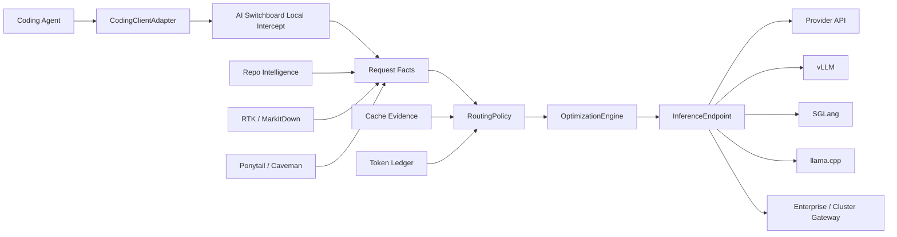

> **Superseded:** Consolidated status and remaining work for this slice now live in [`docs/implementation-plan-master.md`](./docs/implementation-plan-master.md). This document is retained as design history / appendix material; its status labels are no longer authoritative.

# AI Switchboard — Detailed Architecture, Product, Integration, and Optimization Analysis

**Repository:** `tarunag10/ai-switchboard`  
**Analysis date:** 2026-08-16  
**Purpose:** Establish a durable technical and product architecture for the next stage of AI Switchboard, incorporating the existing repository, the optimization stack, coding-agent integrations, external inference infrastructure, DeepSeek Harness, benchmarking, security, and macOS product UX.

---

## 1. How to read this document

This document deliberately separates three kinds of information:

- **Current repository fact** — behavior or structure that exists in the current AI Switchboard repository.
- **External project fact** — behavior documented by the referenced upstream project.
- **Recommendation / inference** — a proposed architectural or product decision for AI Switchboard.

This distinction matters because AI Switchboard already contains production-oriented building blocks that should be preserved rather than rewritten merely to fit a cleaner diagram.

### Repository evidence used

The main repository evidence for this analysis includes:

- `README.md`
- `docs/architecture.md`
- `docs/adapter-lifecycle.md`
- `docs/benchmarks.md`
- `src-tauri/src/optimization/action_policy.rs`
- `src-tauri/src/optimization/model_routing.rs`
- `src-tauri/src/semantic_cache.rs`
- `src-tauri/src/tool_manager/compression_profiles.rs`
- `src-tauri/src/gateway_readiness.rs`
- the proxy/intercept, Repo Intelligence, connector, tool manager, and optimization modules inspected during the earlier architecture review.

The upstream external sources are listed in the final appendix.

---

# 2. Executive conclusion

AI Switchboard should no longer be thought of as a menu-bar utility that toggles Headroom.

It has become a **local-first optimization, routing, and control plane for AI coding agents**.

The product currently spans:

1. coding-client configuration and lifecycle management;
2. request-path prompt/context optimization;
3. shell/tool-output optimization;
4. repository context selection;
5. local cache primitives;
6. prompt-cache-aware policy;
7. preemptive context-window protection;
8. savings attribution and token analytics;
9. model-routing groundwork;
10. read-only agent memory / MCP context delivery;
11. optional behavior-shaping add-ons;
12. gateway readiness;
13. Doctor, rollback, cleanup, release, and updater workflows.

That breadth changes both the architecture and the macOS UX decision.

### Recommended product boundary

> **AI Switchboard is a local-first optimization and routing control plane for AI coding agents. It reduces context, tool-output, and behavioral token waste; safely manages coding-agent connectivity; measures the economic effect of those optimizations; and can route optimized workloads to remote providers or self-hosted inference runtimes.**

The most important boundary is:

- **AI Switchboard decides what context should reach the model, how much is necessary, which coding-client integration is safe, which optimization policies apply, and eventually where a request should go.**
- **The inference runtime decides how the resulting tokens execute efficiently on CPU, GPU, or a distributed cluster.**

This means AI Switchboard should integrate with vLLM, SGLang, TensorRT-LLM, llama.cpp, Dynamo, llm-d, and similar systems rather than attempting to reproduce their scheduler, KV-cache, quantization, kernel, and distributed-inference internals.

---

# 3. Correct product hierarchy

A crucial architectural correction is to keep AI Switchboard, Headroom, coding agents, and inference systems at their proper layers.

```text
AI Switchboard
│
├── Coding-client control plane
│   ├── Claude Code
│   ├── Codex
│   ├── Gemini CLI
│   ├── OpenCode
│   ├── Goose
│   ├── Zed / Windsurf / other supported clients
│   └── DeepSeek Harness
│
├── Context and optimization plane
│   ├── Headroom
│   ├── RTK
│   ├── Repo Intelligence
│   ├── Repo Memory MCP
│   ├── MarkItDown
│   ├── Ponytail
│   └── Caveman
│
├── Policy and economics plane
│   ├── prompt-cache policy
│   ├── compaction policy
│   ├── redundancy evidence
│   ├── response-cache policy
│   ├── model routing
│   └── token/savings accounting
│
└── Inference destination plane
    ├── OpenAI / Anthropic / other APIs
    ├── vLLM
    ├── SGLang
    ├── TensorRT-LLM
    ├── llama.cpp
    ├── Switchyard / LiteLLM / Envoy AI Gateway where appropriate
    └── Dynamo / llm-d / KServe at cluster scale
```

**Headroom is an optimization engine inside AI Switchboard. It is not AI Switchboard itself.**

That distinction should appear consistently in code naming, architecture docs, user-facing copy, telemetry, and future plugin contracts.

---

# 4. Current-state system architecture

## 4.1 Application shell

**Current repository fact:** AI Switchboard is already a Tauri desktop application with a Rust backend and a menu-bar/tray-oriented frontend.

The repository architecture assigns responsibilities roughly as follows:

- frontend UI and onboarding;
- Tauri commands and tray wiring;
- top-level state shaping;
- managed tool installation and runtime control;
- coding-client adapters;
- Repo Intelligence;
- local insights and daily recommendations.

This is already a desktop application architecture, even though the principal interaction surface has historically been a menu-bar window.

---

## 4.2 Current request data path

The current design uses a stable local intercept in front of a dynamically managed Headroom backend.

Conceptually:

```text
Claude / Codex / managed client
             │
             ▼
    127.0.0.1:6767
    AI Switchboard Rust intercept
             │
             ├── safety checks
             ├── request classification
             ├── oversized-turn behavior
             ├── cache policy
             ├── evidence / accounting
             └── forwarding policy
             │
             ▼
      Headroom backend
      commonly :6768
             │
             ▼
       provider endpoint
```

The fixed local intercept is an important architectural asset. It means client configurations can remain stable while internal optimization engines and downstream endpoints evolve.

### Recommendation

Preserve the stable intercept.

Do **not** turn the intercept into a large provider-specific switch statement such as:

```text
if vllm ...
else if sglang ...
else if tensorrt ...
```

Instead evolve it toward:

```text
RequestFacts
    ↓
OptimizationPolicy
    ↓
RouteDecision
    ↓
OptimizationEngine
    ↓
InferenceEndpoint
```

The Rust intercept should remain a small, auditable, safety-critical edge.

---

# 5. Current capability analysis

## 5.1 Managed coding-client lifecycle

One of AI Switchboard's strongest product differentiators is not compression at all. It is the **safe lifecycle for modifying developer tooling**.

The adapter lifecycle requires:

1. detection without reading secrets;
2. dry-run diff or setup preview;
3. timestamped backup or reversible restore point;
4. explicit user consent;
5. Doctor verification;
6. rollback that does not modify unrelated settings;
7. Off-mode and uninstall cleanup;
8. managed-footprint reporting without secret values;
9. manual recovery documentation.

A connector is not supposed to become "managed" until fixture tests cover the whole lifecycle.

### Strategic value

This is difficult to replicate well and highly valuable to users.

A coding-agent optimization product that silently rewrites Claude, Codex, editor, gateway, or shell settings creates trust problems quickly. AI Switchboard's approach turns reversible integration into a first-class subsystem.

### Recommendation

Formalize this into an explicit `CodingClientAdapter` domain interface and make every future agent integration—including DeepSeek Harness—conform to it.

---

## 5.2 Headroom

**Current repository fact:** Headroom is the required optimization runtime for proxy compression.

Switchboard already exposes multiple Headroom-oriented profiles:

- Balanced
- Aggressive
- Codex-heavy
- Claude cache-safe

The profile controls include:

- user-message compression;
- tool-result compression;
- history compression;
- output shaping;
- savings mode;
- verbosity;
- smart compaction behavior.

The existence of the **Claude cache-safe** profile is especially important. It explicitly avoids transformations likely to disturb stable provider-side prefix caching.

### Architectural implication

AI Switchboard already understands a key principle:

> Saving prompt tokens is not automatically beneficial if the transformation destroys a high-value provider prefix-cache hit.

This should become a general policy objective rather than remain only a profile-level heuristic.

---

## 5.3 RTK

RTK operates at a different stage from Headroom.

- Headroom optimizes request/context payloads.
- RTK reduces shell and command output before that output occupies agent context.

This distinction should remain visible in metrics.

### Recommendation

Never merge RTK and Headroom savings into an unexplained "tokens saved" number.

Keep attribution by source:

- Headroom measured input reduction;
- RTK measured tool-output reduction;
- Repo Intelligence estimated avoided context;
- behavior add-ons inferred reductions until measured;
- cache savings as a separate economic category.

---

## 5.4 Repo Intelligence

Repo Intelligence may become a larger differentiator than raw prompt compression.

It is a read-only local repository indexer that can:

- classify repository files;
- identify entrypoints, tests, configs, and implementation areas;
- build bounded context packs;
- create agent-specific handoffs;
- estimate token size;
- record freshness and parser health;
- expose symbol/dependency signals;
- avoid secret-like paths;
- expose read-only query operations;
- feed Repo Memory MCP.

### Why this matters

Compression asks:

> "How can we make these 80,000 tokens smaller?"

Repo Intelligence asks:

> "Why were the irrelevant 70,000 tokens loaded at all?"

Avoided context is frequently more valuable than post-hoc compression.

### Recommendation

Treat Repo Intelligence as a first-class `ContextProvider`, not an add-on.

Long term it should feed optimization policy with structured facts such as:

```text
context_source = repo_intelligence
stability = stable
estimated_relevance = high
estimated_tokens = 4,800
freshness = current
secret_risk = none
```

That lets prompt-cache policy and compression policy make more intelligent decisions.

---

## 5.5 Repo Memory MCP

Repo Memory MCP makes Repo Intelligence consumable by agents without requiring each agent to rediscover the repository.

The current architecture intentionally keeps this read-only.

### Recommendation

Preserve the read-only boundary for the context service even if AI Switchboard later adds repository-writing workflows elsewhere.

Separate interfaces are safer:

```text
ContextProvider  -> read-only
ActionProvider   -> write-capable, consented, audited
```

Do not turn the memory interface into a generic file mutation path.

---

## 5.6 MarkItDown

MarkItDown reduces document ingestion waste by turning PDF/Office content into cleaner Markdown before an agent consumes it.

It belongs in the same high-level class as RTK:

> **pre-context normalization**

It is not an inference optimization.

---

## 5.7 Ponytail

Ponytail is a behavioral optimization add-on.

Its purpose is to encourage smaller, less over-engineered implementation changes. That can reduce:

- generated code;
- unnecessary files;
- tool calls;
- follow-up edits;
- context growth;
- review burden.

This is not token compression in the algorithmic sense.

### Recommended metric class

Measure Ponytail using agent outcomes:

- files changed;
- lines added;
- unnecessary lines;
- tool calls;
- test pass rate;
- rework;
- final task success;
- input/output token count.

---

## 5.8 Caveman

Caveman is an internal guidance/profile mechanism with multiple terseness levels.

The compact-Chinese profile is intentionally constrained to private internal planning/handoffs and not user-visible or safety-critical material.

### Recommendation

Treat Caveman as a first-party `OptimizationAddon` with explicit provenance in the UI.

If no separate canonical upstream project exists, avoid presenting it as though AI Switchboard is merely installing an external dependency.

---

# 6. Current optimization policy primitives

## 6.1 Prompt-cache ordering

The current action policy can reorder prompt segments so stable and more cacheable segments appear earlier.

This is a useful foundation for a cache-aware optimizer.

### Recommendation

Expand the segment metadata over time:

```rust
PromptSegment {
    id,
    source,
    tokens,
    stable,
    cacheable,
    semantic_role,
    quality_criticality,
    sensitivity,
    transform_cost,
    cache_break_risk,
}
```

The optimizer can then choose different transformations by segment.

---

## 6.2 Preemptive compaction

The repository contains threshold-driven compaction planning based on:

- current context tokens;
- context-window size;
- projected next-turn size;
- configured threshold.

This is a good policy primitive.

### Important distinction

A compaction **decision** is not the same thing as a fully proven, end-to-end compaction executor.

Keep documentation precise about whether Switchboard is:

- observing;
- recommending;
- queueing;
- applying;
- verifying.

---

## 6.3 Model routing

The model-routing module currently classifies trivial tasks and proposes a cheap/capable model, but the decision remains `observe_only`.

That is the right state for an immature policy because incorrect automatic model downgrades can reduce task success.

### Recommendation

Do not promote live model routing merely because the heuristic exists.

Promotion should require benchmark evidence that includes:

- quality;
- task success;
- latency;
- total token use;
- price;
- follow-up/rework cost.

The cheapest first request is not necessarily the cheapest successful task.

---

## 6.4 Redundancy

The existing redundancy foundation uses deterministic hashing to identify exact duplicates without exposing raw content in its evidence.

That is useful, but it is **exact redundancy**, not semantic redundancy.

### Recommendation

Keep the names explicit:

- `exact_duplicate_detection`
- future `semantic_redundancy_detection`

Do not claim semantic deduplication until embeddings or another semantic-equivalence technique is actually implemented and evaluated.

---

# 7. Cache taxonomy: keep four concepts separate

"Cache" is one of the easiest places for architecture to become confused.

## 7.1 AI Switchboard exact response cache

The repository currently contains local exact-response-cache primitives.

The namespace includes:

- provider;
- model;
- account;
- workspace;
- policy;
- request variant.

Cache bypasses include:

- streaming;
- tools/MCP;
- sensitive data;
- high temperature;
- rapidly changing repository state;
- open tool calls;
- explicit no-cache behavior.

Prompts are hashed before use as SQLite keys.

### Naming recommendation

Rename the conceptual subsystem from **semantic cache** to something like:

- `response_cache`;
- `exact_response_cache`.

The existing `semantic_v2` behavior is not a true embedding/vector semantic cache.

If approximate semantic reuse is later implemented, give it a separate subsystem and safety policy.

---

## 7.2 Provider prompt/prefix cache

OpenAI, Anthropic, and other APIs may provide prompt caching or cache-read accounting.

AI Switchboard can optimize *for* this cache but does not own the provider's KV memory.

---

## 7.3 Runtime prefix/KV cache

vLLM, SGLang, TensorRT-LLM, LMCache, and distributed serving systems manage runtime KV blocks.

This is below AI Switchboard's token/context layer.

---

## 7.4 Repo Intelligence index cache

Repo Intelligence also has an index/cache lifecycle.

That cache is repository metadata, not LLM response reuse.

### Recommendation

Expose different UI labels:

- **Response cache**
- **Provider prompt cache**
- **Inference KV cache**
- **Repo index cache**

Avoid one generic "Cache" switch.

---

# 8. Gateway readiness

The current `gateway_readiness.rs` is intentionally conservative.

It can inspect only environment-variable **presence**, not values, and by default does not contact remote gateways. The local LiteLLM profile can perform an explicitly requested loopback TCP probe.

Current profiles include examples for:

- LiteLLM local cache/gateway;
- Langfuse export;
- Cloudflare AI Gateway;
- Kong enterprise gateway.

### Strategic conclusion

AI Switchboard already has the beginning of an external infrastructure profile model.

Do not replace it. Generalize it.

A future external profile should separate:

```text
configuration readiness
credential presence
connectivity readiness
protocol compatibility
model discovery
capability discovery
live health
ownership
```

A configuration can be "ready to try" without AI Switchboard falsely claiming that a remote service is live.

---

# 9. DeepSeek Harness: corrected role and integration

## 9.1 What it is

DeepSeek Harness (`deepseek-ai/deepseek-harness`, `dsh`) is an official open-source agent harness from DeepSeek AI.

As of this analysis it is explicitly labeled **developer preview** and warns that compatibility-breaking changes should be expected.

It is MIT licensed.

Its architecture is built around Cordis and makes the product highly composable: model adapters, tool registries, session state, the agent loop, and other capabilities are plugin-oriented.

## 9.2 What it is not

DeepSeek Harness is not equivalent to:

- vLLM;
- SGLang;
- TensorRT-LLM;
- Dynamo.

Those systems operate in the inference-serving layer.

DeepSeek Harness belongs beside Claude Code and Codex in AI Switchboard's **agent/client plane**.

---

## 9.3 Integration level A — CodingClientAdapter

This should be the first integration.

```text
AI Switchboard
   └── DeepSeekHarnessAdapter
         ├── detect
         ├── preview
         ├── backup / reversible profile patch
         ├── apply
         ├── Doctor verify
         ├── rollback
         └── Off cleanup
```

Because dsh is a developer preview, the initial connector should be marked **Experimental / Developer Preview**.

---

## 9.4 Integration level B — native dsh plugin

This is strategically more interesting.

DeepSeek Harness exposes agent lifecycle seams including pre-step/request/tool events. A Switchboard plugin could see structured agent state **before** it is serialized into an HTTP request.

That gives AI Switchboard richer optimization choices.

Example:

```text
DeepSeek Harness
       │
       ├─ system prompt sections
       ├─ tool schemas
       ├─ session history
       ├─ injected repo context
       └─ current user message
       │
       ▼
AI Switchboard dsh plugin
       ├─ classify prompt segments
       ├─ inject Repo Intelligence
       ├─ avoid redundant context
       ├─ enforce context budget
       ├─ preserve stable prefix
       └─ emit optimization evidence
       │
       ▼
llm adapter / endpoint
```

This is better than inspecting a monolithic JSON request after assembly.

---

## 9.5 Integration level C — custom dsh LLM adapter

A custom `ctx.llm` provider could route dsh model traffic into AI Switchboard.

```text
dsh
 ↓
Switchboard LLM adapter
 ↓
127.0.0.1:6767
 ↓
Headroom / policy
 ↓
InferenceEndpoint
```

This is a clean native bridge and a reasonable experimental P2 item.

---

# 10. External inference/runtime landscape

## 10.1 vLLM

vLLM is a high-throughput inference and serving engine with features including:

- PagedAttention;
- continuous batching;
- chunked prefill;
- prefix caching;
- quantization;
- optimized attention and GEMM/MoE kernels;
- speculative decoding;
- disaggregated prefill/decode;
- broad model and API compatibility.

### Recommendation

**First self-hosted inference endpoint.**

Reasons:

- widely used;
- OpenAI-compatible serving surface;
- strong optimization breadth;
- clear separation from Switchboard's context layer;
- useful benchmark target.

Do not embed vLLM's Python runtime inside the macOS app.

Treat it as an external service.

---

## 10.2 SGLang

SGLang provides a different architecture with features such as:

- RadixAttention / prefix reuse;
- high-performance scheduling;
- continuous batching;
- speculative decoding;
- paged attention;
- multiple parallelism modes;
- quantized model support;
- prefill/decode disaggregation;
- strong support for large reasoning and MoE workloads.

### Recommendation

**Second self-hosted endpoint.**

Supporting both vLLM and SGLang prevents the endpoint abstraction from becoming accidentally vLLM-specific.

---

## 10.3 TensorRT-LLM

TensorRT-LLM is NVIDIA's optimized LLM stack with:

- aggressive NVIDIA GPU optimization;
- KV/prefix cache features;
- speculative decoding;
- quantization;
- disaggregated serving;
- multiple execution and communication optimizations.

### Recommendation

P2 optional endpoint for NVIDIA-focused users.

Do not make it a desktop dependency.

---

## 10.4 NVIDIA Dynamo

Dynamo is a datacenter-scale orchestration layer above inference engines.

It coordinates systems such as vLLM, SGLang, and TensorRT-LLM and adds capabilities such as:

- distributed routing;
- disaggregated prefill/decode;
- KV-aware routing;
- multi-tier KV management;
- autoscaling and cluster orchestration.

### Recommendation

P3 hyperscale integration.

If a user runs a single GPU or a single inference server, Dynamo is unnecessary.

---

## 10.5 NVIDIA Switchyard

Switchyard is a Python LLM traffic proxy that provides:

- protocol translation among OpenAI/Anthropic/Responses-style APIs;
- multiple backend routing;
- coding-agent launchers;
- usage statistics;
- custom routing profiles.

There is meaningful overlap with AI Switchboard.

### Overlap

Both can:

- sit between coding agents and models;
- route model traffic;
- launch or configure coding-agent traffic;
- collect request statistics.

### Difference

AI Switchboard additionally owns:

- local Mac UX;
- reversible connector lifecycle;
- Repo Intelligence;
- Headroom optimization;
- RTK;
- Doctor and Rollback;
- local optimization evidence.

### Recommendation

Treat Switchyard as an **optional gateway/profile integration**, not a core dependency.

Avoid unnecessary proxy chains such as:

```text
client
 → Switchboard
 → Headroom
 → Switchyard
 → vLLM
```

unless protocol translation or a Switchyard-specific router provides measurable value.

---

## 10.6 llama.cpp

llama.cpp provides lightweight local inference and an OpenAI-compatible server, with broad support for quantized local models.

### Recommendation

Strong P2 local endpoint.

It fits AI Switchboard's local-first positioning particularly well.

---

## 10.7 LMCache

LMCache is a KV-cache layer intended to improve cache reuse and offload across supported inference systems.

### Recommendation

Do not adopt it just because "more caching" sounds useful.

First benchmark native vLLM/SGLang prefix caching. Add LMCache only when the workload demonstrates enough repeated-prefix value to justify the additional component.

---

## 10.8 LiteLLM

LiteLLM offers a broad LLM SDK/gateway, provider normalization, cost tracking, routing, and load balancing.

AI Switchboard already has a LiteLLM readiness profile.

### Recommendation

Keep LiteLLM external and optional.

Do not turn AI Switchboard into a wrapper around LiteLLM.

---

## 10.9 Envoy AI Gateway

Envoy AI Gateway is a better fit for enterprise/Kubernetes ingress concerns such as:

- centralized provider routing;
- authentication;
- rate limits;
- gateway policy;
- observability.

### Recommendation

P3 enterprise profile.

It belongs at a deployment boundary, not inside the macOS application.

---

## 10.10 llm-d

llm-d focuses on distributed LLM inference on Kubernetes, including advanced request routing and KV-aware deployment patterns.

### Recommendation

At hyperscale, evaluate **Dynamo or llm-d** based on the target infrastructure.

Do not support two distributed orchestration stacks deeply before one real workload requires them.

---

## 10.11 KServe

KServe provides Kubernetes-native serving primitives for predictive and generative AI.

### Recommendation

Useful as an enterprise deployment target/profile; not a desktop dependency.

---

## 10.12 Hugging Face TGI

As of 2026-08-16, the TGI repository is archived and states that it is in maintenance mode. Hugging Face points users toward vLLM, SGLang, llama.cpp, and related downstream engines.

### Recommendation

Do not make TGI a new first-class integration.

Keep compatibility only if users explicitly require it.

---

## 10.13 AIPerf

AIPerf is an active inference benchmark tool and supports modern serving metrics such as:

- TTFT;
- inter-token latency;
- end-to-end latency;
- throughput;
- request-rate/concurrency benchmarking;
- server metrics for modern inference engines.

### Recommendation

Use AIPerf as a **development/benchmark dependency**, not a runtime dependency.

---

## 10.14 DeepSeek inference infrastructure

DeepSeek also publishes lower-level infrastructure such as:

- FlashMLA;
- DeepEP;
- DeepGEMM;
- model serving guidance.

### Recommendation

Do not link these libraries directly into AI Switchboard.

They should be selected and managed by the inference runtime/deployment.

AI Switchboard can record their presence as endpoint/deployment capability metadata when useful.

---

## 10.15 Quantization toolchains

Tools such as AutoRound, GPTQModel, and torchao can prepare or quantize model artifacts.

### Recommendation

Quantization belongs to a **model deployment profile**, not to a `QuantizationBackend` interface inside Switchboard.

Example:

```yaml
model:
  id: Qwen/...
  revision: ...
  quantization:
    method: awq
    bits: 4
  serving_runtime: vllm
```

---

# 11. External-project integration matrix

| Project | Primary role | AI Switchboard relationship | Suggested priority |
|---|---|---|---|
| DeepSeek Harness | Agent harness/runtime | CodingClientAdapter + native plugin experiment | P1/P2 |
| vLLM | Inference engine | First self-hosted `InferenceEndpoint` | P1 |
| SGLang | Inference engine | Second endpoint; validates abstraction | P1 |
| TensorRT-LLM | NVIDIA inference engine | Optional NVIDIA endpoint | P2 |
| NVIDIA Switchyard | Traffic proxy/router | Optional gateway/profile | P2 |
| llama.cpp | Lightweight local inference | Local endpoint | P2 |
| LMCache | KV cache layer | Benchmark-driven optional enhancement | P3 |
| LiteLLM | Provider gateway/router | Existing optional external profile | P2 |
| Envoy AI Gateway | Enterprise gateway | Enterprise/K8s profile | P3 |
| Dynamo | Distributed inference orchestration | Hyperscale endpoint/orchestrator | P3 |
| llm-d | Distributed Kubernetes inference | Alternative hyperscale target | P3 |
| KServe | Kubernetes serving platform | Deployment profile | P3 |
| AIPerf | Benchmarking | Dev/CI benchmark integration | P0/P1 |
| TGI | Legacy inference server | Compatibility only | Reject for new first-class work |

---

# 12. Recommended target architecture

The target architecture should have independent **client**, **optimization**, and **inference** abstractions.



---

# 13. Recommended domain interfaces

## 13.1 CodingClientAdapter

```rust
trait CodingClientAdapter {
    fn id(&self) -> &'static str;
    fn detect(&self) -> DetectionResult;
    fn plan(&self, mode: SwitchboardMode) -> Result<ConfigPlan>;
    fn apply(&self, plan: &ConfigPlan, consent: ConsentToken) -> Result<ApplyReceipt>;
    fn verify(&self) -> Result<VerificationReport>;
    fn rollback(&self, receipt: &ApplyReceipt) -> Result<RollbackReport>;
    fn cleanup_off_mode(&self) -> Result<CleanupReport>;
    fn footprint(&self) -> ManagedFootprint;
}
```

### Implementations

- ClaudeCodeAdapter
- CodexAdapter
- GeminiAdapter
- OpenCodeAdapter
- GooseAdapter
- DeepSeekHarnessAdapter
- other existing managed/guided adapters.

---

## 13.2 OptimizationEngine

```rust
trait OptimizationEngine {
    fn id(&self) -> &'static str;
    fn capabilities(&self) -> OptimizationCapabilities;
    fn configure(&self, profile: &OptimizationProfile) -> Result<()>;
    fn start(&self) -> Result<EngineInstance>;
    fn health(&self) -> HealthReport;
}
```

### First implementation

`HeadroomOptimizationEngine`

This is an abstraction around what already works, not a rewrite of Headroom.

---

## 13.3 OptimizationAddon

```rust
trait OptimizationAddon {
    fn id(&self) -> &'static str;
    fn category(&self) -> AddonCategory;
    fn detect(&self) -> AddonState;
    fn enable(&self) -> Result<()>;
    fn disable(&self) -> Result<()>;
    fn evidence(&self) -> Vec<OptimizationEvidence>;
}
```

Possible implementations:

- RTK
- MarkItDown
- Ponytail
- Caveman
- future Chonkify adapter
- future document/context transforms.

---

## 13.4 ContextProvider

```rust
trait ContextProvider {
    fn id(&self) -> &'static str;
    fn manifest(&self, workspace: &Workspace) -> Result<ContextManifest>;
    fn build_pack(&self, request: &ContextRequest) -> Result<ContextPack>;
    fn freshness(&self, workspace: &Workspace) -> Freshness;
}
```

First implementation:

`RepoIntelligenceContextProvider`

---

## 13.5 InferenceEndpoint

Use **InferenceEndpoint**, not `InferenceBackend`.

AI Switchboard usually does not run inference itself.

```rust
trait InferenceEndpoint {
    fn id(&self) -> &str;
    fn protocol(&self) -> WireProtocol;
    fn base_url(&self) -> Url;
    fn capabilities(&self) -> EndpointCapabilities;
    fn health(&self) -> Result<EndpointHealth>;
}
```

Suggested implementations:

```text
ProviderEndpoint
OpenAICompatibleEndpoint
VllmEndpoint
SglangEndpoint
TensorRtLlmEndpoint
LlamaCppEndpoint
SwitchyardEndpoint
LiteLlmEndpoint
```

---

## 13.6 RoutingPolicy

The policy should take structured facts and return a decision.

```rust
struct RouteDecision {
    optimization_profile: OptimizationProfileId,
    selected_endpoint: EndpointId,
    selected_model: ModelId,
    response_cache_policy: CachePolicy,
    compaction_action: CompactionAction,
    reasons: Vec<PolicyReason>,
    observe_only: bool,
}
```

This subsystem should eventually become the "brain" of AI Switchboard.

---

# 14. Endpoint capability model

Avoid hard-coding every runtime feature into routing logic.

Use a capability object.

```rust
struct EndpointCapabilities {
    protocols: Vec<WireProtocol>,
    streaming: bool,
    tool_calling: bool,
    structured_output: bool,
    prefix_cache: CapabilityState,
    speculative_decoding: CapabilityState,
    continuous_batching: CapabilityState,
    disaggregated_prefill_decode: CapabilityState,
    kv_cache_externalization: CapabilityState,
    quantization_formats: Vec<String>,
    tensor_parallel: bool,
    pipeline_parallel: bool,
    data_parallel: bool,
    expert_parallel: bool,
    max_context_tokens: Option<u64>,
    hardware: Vec<HardwareClass>,
}
```

The exact fields can evolve, but the principle should remain:

> Policy asks about capabilities, not product names.

---

# 15. Optimization-layer map

A useful way to prevent scope creep is to classify every performance feature by layer.

| Layer | Current AI Switchboard position | Recommended ownership |
|---|---|---|
| Input/context reduction | Strong | Switchboard |
| Tool-output reduction | Strong | Switchboard |
| Repository context selection | Strong | Switchboard |
| Behavioral output reduction | Present | Switchboard add-ons |
| Tokenization efficiency | Limited/accounting | Runtime/provider |
| Prompt compression | Strong via Headroom | Switchboard |
| Prefix reuse policy | Emerging | Switchboard policy + provider/runtime |
| Runtime KV-cache management | Not owned | Inference runtime |
| Continuous batching | Not owned | Inference runtime |
| Scheduler optimization | Not owned | Inference runtime |
| Speculative decoding | Not owned | Inference runtime |
| Quantization | Not owned | Deployment/runtime |
| Kernel acceleration | Not owned | Runtime |
| Distributed inference | Not owned | Dynamo/llm-d/etc. |
| Model/endpoint routing | Emerging | Switchboard |

This table should become a product-scoping tool.

---

# 16. The policy brain: optimize net value, not token reduction

A mature optimizer should not use:

```text
more compression = better
```

A better conceptual objective is:

```text
Benefit(compress)
 =
   prefill_compute_saved
 + provider_cost_saved
 + context_window_headroom_value
 - optimizer_latency
 - expected_prefix_cache_loss
 - estimated_quality_risk
```

For endpoint/model routing:

```text
ExpectedTaskCost
 =
   request_cost
 + expected_followup_cost
 + expected_rework_cost
 + infrastructure_cost
```

The policy should select the route with the best expected **successful-task economics**, not simply the cheapest per-token model.

### Inputs the policy can eventually use

- post-optimization input tokens;
- context-window pressure;
- stable-prefix size;
- provider cache-read ratio;
- endpoint price;
- model capability;
- task complexity;
- latency target;
- local GPU availability;
- previous task outcomes;
- Repo Intelligence relevance confidence;
- tool-use likelihood;
- streaming requirement;
- MCP/tool presence;
- response-cache eligibility.

---

# 17. Benchmark architecture

The existing benchmark suite is valuable because it is:

- local-only;
- reproducible;
- independent of API credentials;
- capable of measuring omission risk and fact retention.

Do not replace it.

Add a second layer of **live endpoint benchmarks**.

## 17.1 Required 2×2 benchmark

For every inference runtime or major optimization:

| Variant | Switchboard optimization | Runtime optimization |
|---|---:|---:|
| B00 | Off | Off/minimal |
| B10 | On | Off/minimal |
| B01 | Off | On |
| B11 | On | On |

This isolates the contribution from each layer.

---

## 17.2 Switchboard metrics

Capture:

- original input tokens;
- post-Headroom input tokens;
- RTK avoided tool-output tokens;
- Repo Intelligence estimated avoided scan tokens;
- optimization latency;
- intercept overhead;
- provider prompt-cache reads;
- response-cache hit/miss/bypass;
- compaction decision;
- duplicate/redundancy evidence;
- selected endpoint/model;
- quality confidence;
- successful task outcome.

---

## 17.3 Inference metrics

Capture where the runtime exposes them:

- time to first token;
- inter-token latency / TPOT;
- end-to-end latency;
- input throughput;
- output throughput;
- requests/second;
- p50/p95/p99;
- batch size;
- queue time;
- KV-cache occupancy;
- prefix-cache hit rate;
- GPU memory;
- GPU utilization;
- power / energy if available.

---

## 17.4 Economic metrics

Calculate:

- provider cost/request;
- cost/successful task;
- GPU-seconds/request;
- GPU-seconds/successful task;
- joules/request where measurable;
- optimizer overhead as a percentage of end-to-end latency.

---

## 17.5 Flagship cache benchmark

Because Switchboard modifies prompts, cache economics deserve a dedicated benchmark:

```text
A. No compression + cache
B. Generic compression + cache
C. Cache-safe compression + cache
D. Aggressive compression + cache
```

Measure total successful-task cost, not only input-token count.

This benchmark can become a major product differentiator.

---

# 18. Security model

AI Switchboard operates in a sensitive position:

- it changes developer-tool settings;
- it can see model requests;
- it can access local repository metadata;
- it manages local runtimes;
- it may route to remote or self-hosted endpoints.

Security should therefore remain architectural, not cosmetic.

## 18.1 Preserve existing strengths

Keep:

- loopback-only local intercept defaults;
- explicit Origin/safety checks;
- secret-free footprint reporting;
- redacted gateway readiness;
- read-only Repo Intelligence;
- secret-like path exclusion;
- scoped response-cache namespaces;
- explicit consent before config writes;
- reversible backups and rollback.

---

## 18.2 Endpoint allowlist

Do not allow an optimization policy to silently redirect traffic to an arbitrary URL.

An endpoint should become routable only after:

1. explicit user creation/import;
2. protocol validation;
3. destination display;
4. security classification;
5. health/readiness check;
6. explicit enablement.

---

## 18.3 Model provenance

A self-hosted model profile should record:

```text
model id
model revision / immutable digest
tokenizer revision
quantization method
model license
runtime
runtime version
trust_remote_code state
```

Default `trust_remote_code`-style behavior to disabled wherever the serving stack permits.

---

## 18.4 Cache isolation

For shared or future distributed caches, never use only `model + prompt_hash`.

Retain account/workspace/policy boundaries.

Consider OS-level protection or encryption for stored response bodies if the local response cache becomes a major feature.

---

## 18.5 Telemetry

Prefer content-free metrics by default.

Separate:

- counts;
- timings;
- hashes;
- sizes;
- model/endpoint IDs;
- policy decisions;

from:

- prompt bodies;
- tool output;
- code;
- secrets.

Raw content should require an explicit debugging mode and clear retention policy.

---

# 19. macOS UX decision: full Mac app or menu-bar app?

## Recommendation

**Do not choose between them. Build one Mac application with two surfaces:**

1. a **full main application window** for configuration, analysis, setup, and troubleshooting;
2. a **menu-bar companion** for status, quick mode changes, and immediate operational actions.

This is the strongest fit for what AI Switchboard has become.

---

## 19.1 Why menu-bar-only is now too constrained

The current product includes or is growing toward:

- connector management;
- dry-run diffs;
- Doctor;
- Rollback Center;
- Repo Intelligence;
- Repo Memory MCP;
- token/savings analytics;
- compression profiles;
- response cache;
- endpoint management;
- model routing;
- gateway readiness;
- security evidence;
- update/release status;
- future benchmark results.

A menu-bar popover is excellent for quick control but poor for hierarchical configuration and evidence-heavy workflows.

Problems with menu-bar-only UX include:

- too much vertical scrolling;
- weak navigation;
- difficult comparison views;
- limited space for diffs and logs;
- poor discoverability of advanced features;
- cramped tables/charts;
- tension between "quick status" and "full control panel";
- difficult onboarding.

---

## 19.2 Why full-app-only would also be a regression

Switchboard controls something that developers want to check quickly while coding.

The menu bar is ideal for:

- current mode;
- active optimization engine;
- proxy health;
- active coding client;
- latest token/savings snapshot;
- pause/Off;
- restart local runtime;
- Doctor warning count;
- open main app.

Requiring the user to bring a full app window forward just to switch `Full → Off` would make the product slower to use.

---

## 19.3 Recommended main-window information architecture

A sidebar-oriented main window could contain:

### 1. Overview

- active mode;
- runtime health;
- current client/session;
- today savings;
- cache health;
- warnings;
- quick recommendations.

### 2. Agents & Connectors

- Claude Code
- Codex
- Gemini
- OpenCode
- DeepSeek Harness
- Goose
- editors/other integrations

Each row should show:

```text
Detected
Managed/guided/gated
Routing state
Last verified
Rollback available
Current automation gate
```

### 3. Optimization

- Headroom status;
- compression profile;
- advanced profile controls;
- RTK;
- MarkItDown;
- Ponytail;
- Caveman;
- future optimization plugins.

### 4. Repo Intelligence

- repository selector;
- freshness;
- context packs;
- graph/symbol evidence;
- estimated avoided context;
- Repo Memory MCP state;
- agent handoffs.

### 5. Routing & Models

Future home for:

- remote providers;
- OpenAI-compatible endpoints;
- vLLM;
- SGLang;
- llama.cpp;
- model profiles;
- policy rules;
- model-routing observation/live mode.

### 6. Activity & Savings

- Token X-Ray;
- session ledger;
- Daily Briefing;
- cache metrics;
- measured/estimated/inferred attribution;
- endpoint/model route decisions.

### 7. Doctor & Rollback

- diagnostics;
- repairs;
- dry-run diff;
- backups;
- rollback receipts;
- managed footprint;
- uninstall/Off cleanup.

### 8. Settings

- launch at login;
- menu-bar behavior;
- privacy;
- local storage;
- update channel;
- experimental features;
- developer diagnostics.

---

## 19.4 Recommended menu-bar surface

Keep it intentionally small.

Example:

```text
AI Switchboard
────────────────────────
● Full Optimization
  Headroom: Healthy
  RTK: Active
  Client: Codex

Today
  42.3k tokens avoided
  18% provider cache read

Mode
  ● Full
  ○ Headroom only
  ○ RTK only
  ○ Off

Quick actions
  Run Doctor
  Restart optimizer
  Pause for 30 min
  Open AI Switchboard…

1 warning
```

Do not put full connector configuration or Repo Intelligence management back into this surface.

---

## 19.5 One app bundle, shared state

Conceptually:

```text
AI Switchboard.app
│
├── Rust/Tauri backend
├── local intercept
├── managed runtime supervisor
├── shared application state
│
├── MainWindow
└── MenuBarWindow
```

The two surfaces should not be separate products or separate configuration stores.

---

## 19.6 Window lifecycle

Recommended behavior:

- first launch: open the main window for onboarding;
- normal launch: respect user's preference;
- menu bar remains available while the local service is enabled;
- closing the main window does not need to stop optimization;
- clicking the app icon/menu command reopens the main window;
- critical Doctor/upgrade/recovery actions can bring the main window forward;
- users can choose launch-at-login behavior.

The product should communicate clearly when the UI window is closed but the local optimization service remains active.

---

# 20. Product positioning and moat

Avoid positioning AI Switchboard as simply:

> "a token compression proxy"

That makes the product look replaceable by a single open-source compressor.

A stronger category is:

> **Optimization and routing control plane for coding agents.**

The moat is the composition of multiple layers:

```text
safe client integration
+ context avoidance
+ context compression
+ tool-output reduction
+ cache-aware policy
+ behavioral optimization
+ model/endpoint routing
+ measurable economics
+ local-first privacy
+ rollback and Doctor
```

Few individual infrastructure projects address all of those together.

---

# 21. What AI Switchboard should explicitly not become

## 21.1 Not a GPU inference engine

Do not implement:

- CUDA kernels;
- PagedAttention;
- continuous batching;
- tensor parallelism;
- speculative decoding engines;
- distributed KV transfer.

Integrate runtimes that already do them.

---

## 21.2 Not a Kubernetes distribution

Enterprise integrations can support Kubernetes, but the desktop application should not absorb cluster orchestration logic.

---

## 21.3 Not a generic secret manager

Use Keychain and provider/runtime credential mechanisms. Store the minimum needed.

---

## 21.4 Not an opaque autonomous router

Automatic model/endpoint routing should always expose:

- what route was chosen;
- why;
- evidence;
- override;
- rollback/fallback.

---

## 21.5 Not an ever-growing proxy chain

Every additional network hop must justify itself with:

- protocol translation;
- measurable optimization;
- routing value;
- security boundary;
- observability value.

---

# 22. Priority architecture decisions

| Decision | Priority | Direction |
|---|---:|---|
| AI Switchboard is product/control plane; Headroom is an engine | P0 | Lock terminology |
| Preserve stable Rust intercept | P0 | Yes |
| Formal `CodingClientAdapter` | P0 | Yes |
| Formal `OptimizationEngine` | P0 | Yes |
| Formal `InferenceEndpoint` | P0 | Yes |
| Make action policy the policy brain | P1 | Yes |
| Main Mac window + menu-bar companion | P1 | Yes |
| vLLM endpoint | P1 | First external runtime |
| SGLang endpoint | P1 | Second external runtime |
| DeepSeek Harness adapter | P1 | Experimental |
| DeepSeek Harness native plugin | P2 | Prototype |
| llama.cpp | P2 | Local endpoint |
| Switchyard | P2 | Optional gateway |
| TensorRT-LLM | P2 | NVIDIA endpoint |
| True semantic cache | P2/P3 | Only after safety benchmark |
| LMCache | P3 | Benchmark-dependent |
| Dynamo or llm-d | P3 | Hyperscale |
| TGI new integration | Reject | Archived/maintenance |
| Direct DeepSeek kernel dependency | Reject | Runtime-owned |

---

# 23. Recommended end-state deployment patterns

## 23.1 Minimal local / provider mode

```text
Claude / Codex / dsh
       ↓
AI Switchboard :6767
       ↓
Headroom
       ↓
OpenAI / Anthropic / DeepSeek / other provider
```

Optional:

- RTK
- Repo Intelligence
- Repo Memory MCP
- Ponytail
- Caveman
- MarkItDown

No GPU or Kubernetes dependency.

---

## 23.2 Self-hosted GPU mode

```text
Coding agent
    ↓
AI Switchboard
    ↓
Headroom / policy
    ↓
InferenceEndpoint(vLLM or SGLang)
    ↓
GPU server
```

Runtime owns:

- batching;
- KV cache;
- prefix cache implementation;
- quantization;
- speculative decoding;
- kernels.

---

## 23.3 Hyperscale mode

```text
Coding agents
     ↓
local AI Switchboard optimization/control
     ↓
enterprise ingress if required
     ↓
Dynamo OR llm-d
     ↓
vLLM / SGLang / TensorRT-LLM
     ↓
GPU cluster
```

Switchboard remains the agent-facing optimization/control plane.

---

# 24. Final architectural recommendation

The next stage of AI Switchboard should focus on **interfaces and policy**, not on collecting more standalone optimizers.

The sequence that provides the strongest foundation is:

1. formalize the current client/optimizer/context boundaries;
2. preserve and harden the stable intercept;
3. add a generic `InferenceEndpoint`;
4. add a full main Mac window while retaining the menu bar;
5. integrate vLLM;
6. integrate DeepSeek Harness as an experimental client;
7. integrate SGLang;
8. promote the action policy into a cache-aware, economics-aware decision engine;
9. add live benchmark gates before automatic routing;
10. expand into enterprise/hyperscale integrations only after single-endpoint behavior is proven.

The central strategic idea is simple:

> **Do less work before the model, then send the remaining work to the best execution environment.**

That is a coherent category and a much more defensible product than a collection of unrelated token-saving toggles.

---

# Appendix A — Primary external sources

The following links were used or verified during the architecture research. Project status can change, so release engineering should re-check them before each new first-class integration.

- AI Switchboard: https://github.com/tarunag10/ai-switchboard
- DeepSeek Harness: https://github.com/deepseek-ai/deepseek-harness
- vLLM: https://github.com/vllm-project/vllm
- SGLang: https://github.com/sgl-project/sglang
- TensorRT-LLM: https://github.com/NVIDIA/TensorRT-LLM
- NVIDIA Dynamo: https://github.com/ai-dynamo/dynamo
- NVIDIA Switchyard: https://github.com/NVIDIA-NeMo/Switchyard
- llama.cpp: https://github.com/ggml-org/llama.cpp
- LMCache: https://github.com/LMCache/LMCache
- LiteLLM: https://github.com/BerriAI/litellm
- Envoy AI Gateway: https://github.com/envoyproxy/ai-gateway
- llm-d: https://github.com/llm-d/llm-d
- KServe: https://github.com/kserve/kserve
- AIPerf: https://github.com/ai-dynamo/aiperf
- Hugging Face TGI: https://github.com/huggingface/text-generation-inference
- DeepSeek FlashMLA: https://github.com/deepseek-ai/FlashMLA
- DeepSeek DeepEP: https://github.com/deepseek-ai/DeepEP
- DeepSeek DeepGEMM: https://github.com/deepseek-ai/DeepGEMM
- LLMLingua: https://github.com/microsoft/LLMLingua
- AutoRound: https://github.com/intel/auto-round
- GPTQModel: https://github.com/ModelCloud/GPTQModel
- torchao: https://github.com/pytorch/ao

---

# Appendix B — License handling principle

Before promoting any external integration to first-class managed status:

1. record upstream repository and immutable version;
2. record SPDX license;
3. inspect third-party notices;
4. distinguish runtime dependency from optional external service;
5. include binary/package provenance;
6. include update source;
7. include uninstall behavior;
8. run dependency/license scanning in CI;
9. do not imply upstream endorsement;
10. document whether AI Switchboard redistributes the dependency or merely connects to it.

This is especially important for projects whose repositories contain examples, bundled model artifacts, enterprise directories, or third-party components under licenses different from the core project.

