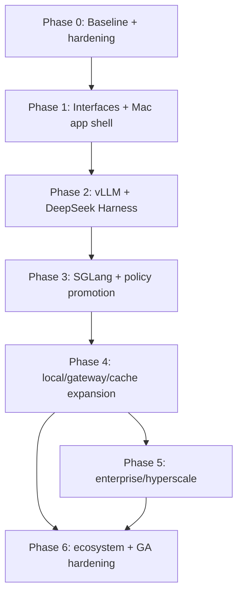

> **Program specification:** The Phase 0–6 acceptance criteria below remain the detailed program spec. Canonical status, remaining work, and execution order live in [`docs/implementation-plan-master.md`](./docs/implementation-plan-master.md), which supersedes all status labels here.

# AI Switchboard — Phased Implementation Plan

**Repository:** `tarunag10/ai-switchboard`  
**Plan date:** 2026-08-16  
**Purpose:** Convert the architecture analysis into an executable, phase-wise engineering program with explicit priorities, dependency order, workstream distribution, acceptance criteria, benchmark gates, security gates, and release gates.

---

# 1. Implementation objective

Build AI Switchboard into a stable **local-first optimization and routing control plane for AI coding agents** while preserving the parts already working:

- stable local intercept;
- Headroom;
- RTK;
- Repo Intelligence;
- Repo Memory MCP;
- reversible connector lifecycle;
- Doctor;
- Rollback;
- token/savings evidence;
- macOS release/update pipeline.

The implementation should expand toward:

- a full Mac application window plus menu-bar companion;
- explicit architecture interfaces;
- external inference endpoints;
- DeepSeek Harness;
- benchmark-backed model/endpoint routing;
- cache-aware optimization;
- enterprise/hyperscale profiles.

The plan intentionally avoids rewriting mature external inference technology.

---

# 2. Priority vocabulary

## P0 — Foundation / release blocker

Required before architecture expansion. A P0 item protects correctness, security, reversibility, or the integrity of future abstractions.

## P1 — Core product expansion

Important enough to define the next major product shape.

## P2 — Advanced / optional integration

Valuable after the P0/P1 foundation is proven.

## P3 — Enterprise / hyperscale / ecosystem expansion

Do not pull these forward unless a real workload demands them.

## Reject / defer

Technically possible but strategically wrong, duplicative, obsolete, or insufficiently justified.

---

# 3. Non-negotiable engineering invariants

Every phase must preserve the following.

### 3.1 Client configuration invariant

No managed coding-client write without:

```text
detect
→ preview
→ backup/restore point
→ explicit consent
→ apply
→ verify
→ rollback
→ Off cleanup
```

### 3.2 Request-path invariant

The stable local intercept remains small, auditable, fail-open where appropriate, and safe.

### 3.3 Secrets invariant

Never return, log, or export credential values in normal diagnostic/analytics paths.

### 3.4 Repo Intelligence invariant

Repository context indexing remains read-only unless a future write-capable subsystem is separately designed.

### 3.5 Routing invariant

No automatic endpoint/model routing becomes live without benchmark evidence and an explicit user-controlled promotion gate.

### 3.6 Cache invariant

Response cache, provider prompt cache, runtime KV cache, and repo index cache remain separate concepts.

### 3.7 UI invariant

Every automated operation that can alter developer configuration has a visible state, explanation, and recovery path.

---

# 4. Recommended workstream distribution

Because team size is unknown, use percentage distribution rather than headcount.

| Workstream | Program share | Primary responsibility |
|---|---:|---|
| Rust core / request path / policy | 25% | intercept, policy, endpoint interfaces, cache, runtime supervisor |
| Client integrations | 15% | adapters, DeepSeek Harness, lifecycle fixtures |
| macOS/Tauri UI | 20% | main app, menu bar, navigation, evidence UI |
| Repo Intelligence / context | 10% | context provider, MCP, graph quality |
| Benchmarks / observability | 12% | local benchmark, AIPerf bridge, metrics, routing evidence |
| Security / rollback / release | 13% | threat controls, privacy, updater, installed-app proof |
| Documentation / developer experience | 5% | architecture, support matrix, plugin/profile docs |

The percentage can shift by phase, but **security/reversibility and benchmark work should not become cleanup tasks at the end**.

---

# 5. Recommended target module boundaries

Before adding several new runtime integrations, create a stable vocabulary.

```text
src-tauri/src/
├── clients/
│   ├── mod.rs
│   ├── adapter.rs
│   ├── claude.rs
│   ├── codex.rs
│   └── deepseek_harness.rs
│
├── optimization/
│   ├── engine.rs
│   ├── headroom.rs
│   ├── action_policy.rs
│   ├── compaction.rs
│   ├── redundancy.rs
│   ├── model_routing.rs
│   └── token_ledger.rs
│
├── context/
│   ├── provider.rs
│   ├── repo_intelligence.rs
│   └── repo_memory_mcp.rs
│
├── endpoints/
│   ├── mod.rs
│   ├── endpoint.rs
│   ├── openai_compatible.rs
│   ├── provider.rs
│   ├── vllm.rs
│   ├── sglang.rs
│   └── llama_cpp.rs
│
├── cache/
│   ├── response_cache.rs
│   └── prompt_cache_evidence.rs
│
└── telemetry/
    ├── events.rs
    ├── savings.rs
    └── runtime_metrics.rs
```

This exact physical restructuring is optional. The domain separation is not.

Do not perform a large directory move and feature work in the same PR.

---

# 6. Phase dependency map



The phases represent dependency order, not calendar commitments.

---

# 7. PHASE 0 — Establish a trustworthy baseline

**Priority:** P0  
**Goal:** Make current behavior measurable, testable, and unambiguous before architecture expansion.

---

## 7.1 P0.1 — Lock product terminology

### Change

Use canonical terms everywhere:

- **AI Switchboard** = product/control plane
- **Headroom** = optimization engine
- **coding client / agent** = Claude Code, Codex, DeepSeek Harness, etc.
- **InferenceEndpoint** = provider/self-hosted serving destination
- **response cache** = Switchboard exact replay cache
- **prompt cache** = provider-side prefix/prompt cache
- **KV cache** = inference-runtime cache

### Acceptance criteria

- architecture docs use the terms consistently;
- UI does not imply Headroom is the entire product;
- telemetry event names use stable nouns;
- "semantic cache" is not used for exact cache behavior in new code.

---

## 7.2 P0.2 — Create architecture decision records

Create lightweight ADRs for:

1. stable intercept ownership;
2. coding-client adapter lifecycle;
3. Headroom as first `OptimizationEngine`;
4. `InferenceEndpoint` boundary;
5. cache taxonomy;
6. hybrid Mac-window + menu-bar UX;
7. model routing remaining observe-only until benchmark promotion.

### Acceptance criteria

Every high-level decision has:

```text
context
decision
alternatives
consequences
reversal strategy
```

---

## 7.3 P0.3 — Baseline benchmark manifest

Extend the current local benchmark suite without removing its offline behavior.

Add a machine-readable run manifest:

```json
{
  "switchboardCommit": "...",
  "platform": "...",
  "fixturesVersion": "...",
  "headroomVersion": "...",
  "rtkVersion": "...",
  "profile": "...",
  "results": []
}
```

### Required current metrics

- original token estimate;
- optimized estimate;
- saved tokens/percent;
- latency overhead;
- fact retention;
- wrong omission;
- static success proxy;
- quality label.

### Acceptance criteria

- deterministic local run;
- JSON artifact;
- human-readable Markdown summary;
- CI can compare against a stored baseline;
- regressions have thresholds rather than arbitrary pass/fail.

---

## 7.4 P0.4 — Create live benchmark harness contract

Do not implement every runtime yet.

Define:

```rust
trait LiveBenchmarkTarget {
    fn id(&self) -> &str;
    fn endpoint(&self) -> &dyn InferenceEndpoint;
    fn warmup(&self) -> Result<()>;
    fn run_case(&self, case: BenchmarkCase) -> Result<BenchmarkResult>;
}
```

### Required 2×2 variants

- B00 Switchboard off / runtime baseline
- B10 Switchboard on / runtime baseline
- B01 Switchboard off / runtime optimized
- B11 Switchboard on / runtime optimized

### Acceptance criteria

A mock/local endpoint can run all four variants before vLLM integration begins.

---

## 7.5 P0.5 — Request-path regression suite

Create fixtures for:

- OpenAI-compatible non-streaming;
- OpenAI-compatible streaming;
- Anthropic-style requests;
- tool-bearing requests;
- oversized request bypass;
- no-cache;
- sensitive data;
- account/workspace namespace;
- optimizer unavailable;
- downstream unavailable;
- malformed response;
- cancellation;
- retry.

### Acceptance criteria

The stable intercept can be refactored later without changing current client behavior unintentionally.

---

## 7.6 P0.6 — Connector lifecycle fixture completeness

Generate a status matrix for every connector.

Example:

| Connector | Detect | Preview | Backup | Apply | Verify | Rollback | Off | Fixture proof |
|---|---:|---:|---:|---:|---:|---:|---:|---:|
| Claude | ✓ | ✓ | ✓ | ✓ | ✓ | ✓ | ✓ | ✓ |
| Codex | ✓ | ✓ | ✓ | ✓ | ✓ | ✓ | ✓ | ✓ |
| ... | | | | | | | | |

### Acceptance criteria

No UI label says "Managed" unless the lifecycle contract is satisfied.

---

## 7.7 P0.7 — Security baseline

Add or verify tests for:

- remote gateway probes disabled by default;
- loopback-only local probe rules;
- log redaction;
- secret-like Repo Intelligence exclusions;
- cache namespace isolation;
- config backup permissions;
- external URL validation;
- updater signature verification;
- managed-footprint exports free of secrets.

---

## Phase 0 exit gate

Do not move into multi-endpoint routing until:

- current behavior has a reproducible baseline;
- connector statuses match fixture evidence;
- terminology is stable;
- request-path regression tests pass;
- security baseline is green.

---

# 8. PHASE 1 — Formalize the architecture and promote AI Switchboard to a full Mac app

**Priority:** P0/P1  
**Goal:** Create the domain interfaces and UX shell that future integrations plug into.

---

## 8.1 P1.1 — Introduce `CodingClientAdapter`

Refactor existing connectors incrementally behind the interface.

Do **not** rewrite all connector code at once.

Recommended sequence:

1. Claude
2. Codex
3. one promoted non-Claude/Codex connector
4. remaining connectors

### Acceptance criteria

Each adapter returns structured:

- detection evidence;
- plan/diff;
- apply receipt;
- verification report;
- rollback report;
- footprint.

The UI consumes the structured contract rather than connector-specific booleans.

---

## 8.2 P1.2 — Introduce `OptimizationEngine`

Wrap current Headroom behavior.

### Important

This is an adapter around current behavior, not a reimplementation.

### Acceptance criteria

The rest of the app can ask:

```text
engine capabilities
engine state
engine profile
engine health
engine start/stop
```

without assuming "Headroom process" everywhere.

---

## 8.3 P1.3 — Introduce `ContextProvider`

Wrap Repo Intelligence/Repo Memory read-only context behavior.

### Acceptance criteria

A future agent integration can request a pack through a stable contract without importing Repo Intelligence internals.

---

## 8.4 P1.4 — Introduce `InferenceEndpoint`

Start with two classes only:

1. current remote provider endpoint;
2. generic OpenAI-compatible endpoint.

Do not add vLLM-specific logic until the generic endpoint passes tests.

### Core fields

```text
id
label
base URL
protocol
health policy
model ID
capabilities
credential strategy
security classification
enabled
```

---

## 8.5 P1.5 — Create `EndpointCapabilities`

Capabilities should be data, not product-specific conditionals.

Start with:

- protocol;
- streaming;
- tools;
- structured output;
- max context;
- prefix cache evidence;
- health endpoint;
- model discovery.

Add GPU-specific fields only when vLLM/SGLang work requires them.

---

## 8.6 P1.6 — Create a unified policy input/output contract

Refactor `optimization/action_policy.rs` toward:

```text
RequestFacts
 + ClientFacts
 + ContextFacts
 + CacheFacts
 + EndpointFacts
 + UserPolicy
       ↓
RouteDecision
```

For Phase 1, route decisions remain conservative.

### Acceptance criteria

Existing compaction/model-routing/prompt-order decisions are accessible through one policy facade.

---

# 9. PHASE 1 UX — Full Mac application + menu-bar companion

This UX work belongs in the same phase as the architecture interfaces because future endpoint and connector features need proper screen space.

---

## 9.1 Create the main application window

Recommended initial sidebar:

```text
Overview
Agents & Connectors
Optimization
Repo Intelligence
Activity & Savings
Doctor & Rollback
Settings
```

Add `Routing & Models` once the endpoint feature becomes user-visible.

---

## 9.2 Keep the menu bar

Reduce it to operational essentials:

- current mode;
- Headroom/optimizer health;
- active client if known;
- savings snapshot;
- mode switch;
- Run Doctor;
- restart optimizer;
- Open AI Switchboard.

---

## 9.3 Move complex controls out of the menu bar

The following should be main-window-first:

- connector setup;
- dry-run diffs;
- rollback history;
- Repo Intelligence;
- model endpoint forms;
- gateway readiness;
- benchmark results;
- cache namespaces;
- advanced compression profile editing.

---

## 9.4 UI state architecture

Use one source of truth.

```text
Rust application state
       ↓
shared frontend state
      ↙ ↘
MainWindow  MenuBarWindow
```

Avoid duplicate settings stores.

---

## 9.5 Main-window acceptance criteria

- can open from Dock/app launcher;
- can open from menu bar;
- closing the main window does not silently disable running optimization;
- active background/local service state is obvious;
- onboarding is full-window;
- Doctor/rollback can show detailed evidence;
- keyboard navigation works;
- layouts work without menu-bar-width constraints.

---

## Phase 1 exit gate

- core interfaces compile and have unit tests;
- Headroom runs through `OptimizationEngine`;
- current provider path is represented as an `InferenceEndpoint`;
- main app window exists;
- menu bar remains functional;
- no connector loses rollback behavior.

---

# 10. PHASE 2 — First external inference runtime + DeepSeek Harness

**Priority:** P1  
**Goal:** Validate both directions of expansion: downward into inference runtimes and upward into a new agent harness.

---

# 10A. vLLM integration

## 10.1 P2.1 — Generic OpenAI-compatible endpoint first

Support user-managed endpoint profiles such as:

```yaml
id: local-gpu
type: openai-compatible
base_url: http://192.168.1.50:8000/v1
model: ...
```

### Security requirements

- endpoint allowlist;
- explicit user action;
- clear remote/local classification;
- no silent discovery across the network;
- no credential values in diagnostics.

---

## 10.2 P2.2 — vLLM verified profile

A vLLM profile adds:

- known health/model probes;
- runtime identification;
- capability mapping;
- benchmark metadata.

Do **not** make the desktop app install vLLM.

### Acceptance criteria

A remote or local-network vLLM server can be:

1. added;
2. verified;
3. selected manually;
4. routed through the existing intercept;
5. disabled without modifying coding-client config again.

---

## 10.3 P2.3 — vLLM benchmark adapter

Capture:

- TTFT;
- ITL/TPOT;
- end-to-end latency;
- throughput;
- prefix-cache metrics where available;
- queue metrics;
- GPU metrics if exposed.

Use AIPerf or runtime-native metrics in developer benchmark mode.

---

# 10B. DeepSeek Harness integration

## 10.4 P2.4 — `DeepSeekHarnessAdapter`

Initial status:

**Experimental — upstream developer preview**

Lifecycle:

```text
detect dsh
→ inspect profile/config surface without secrets
→ dry-run patch
→ reversible change
→ apply with consent
→ verify
→ rollback
→ Off cleanup
```

### Acceptance criteria

- no assumptions about a permanently stable upstream schema;
- upstream version captured in verification evidence;
- breaking-version mismatch degrades to guided mode rather than performing unsafe writes.

---

## 10.5 P2.5 — dsh endpoint path

First native integration can route dsh's LLM provider to AI Switchboard.

Preferred order:

1. prove using supported dsh config/adapter seam;
2. create a small Switchboard LLM adapter/plugin if it materially improves safety;
3. avoid patching DeepSeek Harness core.

---

## 10.6 P2.6 — dsh native context prototype

Prototype Repo Intelligence injection through the dsh plugin lifecycle.

Goal:

```text
Repo Intelligence pack
→ dsh agent lifecycle
→ model-visible context
```

Measure whether native structured insertion:

- reduces tokens;
- improves relevance;
- preserves session replay;
- avoids duplicate context.

Keep this experimental until upstream stability improves.

---

## Phase 2 exit gate

- vLLM works as an external endpoint without desktop Python/GPU dependencies;
- DeepSeek Harness passes the Switchboard adapter lifecycle;
- both integrations have rollback/failure tests;
- no automatic model routing required.

---

# 11. PHASE 3 — SGLang and benchmark-backed routing policy

**Priority:** P1/P2  
**Goal:** Prove endpoint abstraction independence and turn policy groundwork into controlled behavior.

---

## 11.1 P3.1 — SGLang endpoint

Implement as another verified OpenAI-compatible endpoint profile.

### Acceptance criteria

No changes to `CodingClientAdapter` are required to switch between vLLM and SGLang.

If changing runtime requires coding-client-specific code, the boundary is wrong.

---

## 11.2 P3.2 — Capability normalization

Normalize vLLM/SGLang evidence into:

```text
prefix_cache
speculative_decoding
continuous_batching
disaggregated_prefill_decode
quantization
parallelism
max_context
tool_calling
```

Capabilities may be:

```text
supported
unsupported
unknown
configured
observed
```

Do not confuse "runtime supports feature" with "feature enabled on this endpoint."

---

## 11.3 P3.3 — Promote action policy into the policy brain

Add an explicit scoring model.

Conceptual form:

```text
net_value =
    input_cost_saved
  + prefill_compute_saved
  + context_headroom_value
  - optimization_latency
  - cache_break_cost
  - quality_risk
```

The first version can be rule-based.

Do not add ML just to make the router sound intelligent.

---

## 11.4 P3.4 — Model routing experiment gate

Current model routing is observe-only.

Promotion path:

### Stage A — observe

Record:

- proposed cheap/capable model;
- reason;
- actual model;
- task outcome.

### Stage B — user-approved

Show suggestion:

```text
This looks like a low-risk formatting task.
Use cheaper model?
```

### Stage C — automatic for allowlisted task classes

Only after benchmark threshold.

### Automatic-routing acceptance criteria

For each allowed task class:

- success rate does not regress beyond configured limit;
- average successful-task cost improves;
- follow-up/rework does not erase the savings;
- user can disable it globally or per client;
- route reason is visible.

---

## 11.5 P3.5 — Endpoint routing

Keep endpoint routing separate from model routing.

Example:

```text
model = qwen-coder
endpoint candidates:
  local-vllm
  local-sglang
  remote-provider
```

Policy can route by:

- endpoint health;
- cost;
- queue/latency;
- privacy policy;
- required feature;
- model availability.

---

## 11.6 P3.6 — Cache-aware compression policy

Use provider prompt-cache evidence.

Introduce profile recommendation logic:

```text
high stable-prefix cache value
    → conservative/cache-safe transform

low cache value + high context pressure
    → stronger compression
```

### Benchmark gate

Use four cache variants:

- no compression;
- normal compression;
- cache-safe compression;
- aggressive compression.

---

## Phase 3 exit gate

- vLLM and SGLang both work through the same endpoint abstraction;
- policy can explain every decision;
- live routing is still gated by measured success;
- cache-aware profile selection has benchmark evidence.

---

# 12. PHASE 4 — Local inference, gateways, and cache maturity

**Priority:** P2  
**Goal:** Expand deployment flexibility without destabilizing core routing.

---

## 12.1 P4.1 — llama.cpp

Add a verified local endpoint profile.

Why:

- local-first fit;
- smaller hardware footprint;
- easy OpenAI-compatible service;
- useful for privacy/offline workflows.

### UI

Display:

- endpoint host;
- model;
- local/remote classification;
- context size;
- runtime health;
- quantization metadata if known.

---

## 12.2 P4.2 — Switchyard optional profile

Add only if it provides one of:

- required protocol translation;
- desired multi-backend router;
- agent launcher compatibility not easily provided by Switchboard.

### Anti-goal

Do not make Switchyard the mandatory path for vLLM/SGLang.

---

## 12.3 P4.3 — Expand LiteLLM readiness into endpoint profile

Reuse existing readiness concepts.

Keep:

- secret values redacted;
- remote connectivity opt-in;
- external ownership explicit.

---

## 12.4 P4.4 — Rename exact response cache

Move conceptual naming toward:

```text
Exact Response Cache
```

or:

```text
Response Cache
```

### UI requirements

Show:

- enabled;
- safe/bypass rules;
- entries;
- hits;
- misses;
- namespace;
- storage path;
- clear action.

---

## 12.5 P4.5 — True semantic cache experiment

Only if there is a real use case.

A true semantic cache requires:

- embedding or semantic representation;
- similarity threshold;
- safety rules;
- workspace/account/model isolation;
- stale-code detection;
- task-type constraints;
- quality benchmark.

### Initial restrictions

Do not use semantic reuse for:

- tool-bearing turns;
- changing repositories;
- high-risk actions;
- arbitrary code-generation requests;
- non-deterministic/high-temperature requests.

---

## 12.6 P4.6 — LMCache experiment

Benchmark only after native runtime prefix caching.

Promotion requires a meaningful improvement in:

- TTFT;
- GPU utilization;
- successful-task cost;

without unacceptable operational complexity.

---

## Phase 4 exit gate

AI Switchboard should support three strong deployment classes:

1. cloud provider;
2. self-hosted GPU;
3. lightweight local model.

Gateway/cache extras must remain optional.

---

# 13. PHASE 5 — Enterprise and hyperscale infrastructure

**Priority:** P3  
**Goal:** Support organizations running distributed inference without turning the desktop product into a cluster manager.

---

## 13.1 P5.1 — Observability standardization

Export content-free telemetry compatible with standard observability systems.

Recommended fields:

```text
request_id
client
optimization_profile
before_tokens
after_tokens
cache_read_tokens
route_model
route_endpoint
optimizer_latency
ttft
itl
e2e
status
quality_outcome_reference
```

Use OpenTelemetry/Prometheus-style interfaces where practical.

---

## 13.2 P5.2 — Enterprise gateway profile

Choose based on target infrastructure.

Potential:

- Envoy AI Gateway
- organization-managed LiteLLM
- Switchyard
- other documented gateway

AI Switchboard should connect to the gateway, not manage its cluster.

---

## 13.3 P5.3 — Dynamo OR llm-d proof

Select one based on a concrete deployment.

### Dynamo if:

- NVIDIA/datacenter architecture is the target;
- KV-aware routing / disaggregated serving is desired;
- the serving stack aligns with supported engines.

### llm-d if:

- Kubernetes-native distributed inference is the target;
- its routing/deployment model better matches the organization.

### Rule

Do not deeply support both in the first hyperscale release.

---

## 13.4 P5.4 — TensorRT-LLM endpoint

Add where NVIDIA-specific performance justifies it.

AI Switchboard still treats it as an endpoint.

---

## 13.5 P5.5 — Multi-tenant policy

Before enterprise shared caches/runtimes:

- account isolation;
- workspace isolation;
- endpoint permissions;
- route policies;
- cache namespace isolation;
- audit log;
- admin/user policy separation.

---

## Phase 5 exit gate

Enterprise integration is considered complete only when a deployment can prove:

```text
client identity
→ optimization policy
→ endpoint policy
→ routing evidence
→ telemetry
→ audit/recovery
```

without leaking secrets or prompt content by default.

---

# 14. PHASE 6 — Plugin ecosystem and general release hardening

**Priority:** P2/P3  
**Goal:** Make future optimizations/integrations cheaper to add without compromising trust.

---

## 14.1 P6.1 — Formal promotion-gate framework

Generalize the pattern already used for experimental adapters such as Chonkify/PXPipe.

A plugin promotion gate should require:

- provenance;
- license;
- no-network declaration where applicable;
- deterministic fixtures;
- quality threshold;
- wrong-omission threshold;
- rollback/uninstall if it writes state;
- version pin;
- update source.

---

## 14.2 P6.2 — Plugin categories

Use explicit categories:

```text
OptimizationEngine
OptimizationAddon
ContextProvider
CodingClientAdapter
InferenceEndpointProfile
TelemetryExporter
```

Avoid one universal plugin interface.

---

## 14.3 P6.3 — DeepSeek Harness plugin maturity

If upstream APIs stabilize, promote the dsh native integration.

Potential capabilities:

- Repo Intelligence injection;
- request metadata;
- tool-result optimization;
- prompt-segment classification;
- Switchboard route decision;
- savings evidence.

---

## 14.4 P6.4 — Installed-app/reboot proof

Complete the release concerns already called out in the repository:

- signed/notarized installed-app smoke;
- reboot-level Doctor proof;
- reboot-level rollback proof;
- uninstall cleanup proof;
- updater recovery test;
- launch-at-login test;
- migration test from legacy app storage.

---

# 15. macOS UI implementation breakdown

This is a concrete work package independent of endpoint work.

---

## 15.1 Main window shell

### P1

Create:

- navigation/sidebar;
- toolbar/status;
- route containers;
- empty/loading/error states;
- global health banner.

### Definition of done

The menu-bar UI can link every complex workflow into a full-window route.

---

## 15.2 Overview screen

### P1

Cards:

- mode;
- optimizer health;
- active connectors;
- today's measured/estimated savings;
- cache summary;
- repo index state;
- warnings;
- last Doctor state.

Avoid a dashboard full of decorative metrics. Every card should lead to an action or diagnosis.

---

## 15.3 Agents & Connectors screen

### P1

Each connector gets:

- installation detection;
- support level;
- routing state;
- verification;
- managed footprint;
- preview;
- repair;
- rollback;
- Off cleanup;
- version evidence.

DeepSeek Harness appears as **Developer Preview / Experimental** initially.

---

## 15.4 Optimization screen

### P1

Sections:

```text
Engine
  Headroom
Profiles
  Balanced
  Aggressive
  Codex-heavy
  Claude cache-safe
Tool/context add-ons
  RTK
  MarkItDown
  Ponytail
  Caveman
```

Advanced controls should be collapsible.

---

## 15.5 Repo Intelligence screen

### P1

Keep this a first-class screen.

Add:

- native repo picker;
- freshness indicator;
- index health;
- skipped-file reasons;
- pack size/budget;
- graph/symbol summary;
- target-agent handoff;
- Repo Memory MCP health;
- clear/re-index.

---

## 15.6 Routing & Models screen

### P2

Tabs or sections:

- Providers
- Self-hosted endpoints
- Models
- Routing policy
- Gateway profiles

Each endpoint row:

```text
name
type
URL/host
local/remote
health
model
capability summary
last benchmark
enabled
```

---

## 15.7 Activity & Savings

### P1/P2

Visualize separately:

- measured;
- estimated;
- inferred.

Never aggregate them without labels.

Add route-decision history later.

---

## 15.8 Doctor & Rollback

### P1

This should become a major trust screen.

For each item:

```text
problem
impact
evidence
planned change
backup
repair
verification
rollback
manual recovery
```

---

## 15.9 Menu-bar redesign

### P1

Keep only:

- mode;
- health;
- current client/session if reliable;
- today's savings;
- warnings;
- quick switches;
- open main window.

This reduces menu-bar cognitive load as features grow.

---

# 16. Benchmark program in implementation form

## 16.1 Benchmark classes

### Class A — deterministic local fixtures

Existing suite.

### Class B — endpoint microbenchmark

AIPerf/runtime metrics.

### Class C — coding-agent task benchmark

Real repositories/tasks with success criteria.

### Class D — longitudinal local evidence

Anonymous/content-free user-local history used only for recommendations unless explicitly exported.

---

## 16.2 Coding-agent task benchmark fields

Each task should define:

```yaml
task_id:
repo_fixture:
task:
success_command:
allowed_files:
quality_assertions:
expected_risk:
```

Record:

- input/output tokens;
- files changed;
- lines changed;
- tool calls;
- retries;
- test result;
- elapsed time;
- selected model;
- selected endpoint;
- optimization profile;
- provider cache reads.

---

## 16.3 Ponytail/Caveman experiment matrix

For a controlled set:

```text
baseline
Ponytail
Caveman scoped
Caveman aggressive
Ponytail + Caveman
```

Measure:

- success;
- LOC;
- unnecessary LOC;
- tool calls;
- tokens;
- rework.

Only advertise savings claims that match evidence confidence.

---

# 17. Security implementation backlog

## P0

- endpoint URL validation;
- loopback rules;
- log redaction;
- cache namespace tests;
- secret-path Repo Intelligence fixtures;
- updater signature tests;
- config permissions.

## P1

- endpoint allowlist;
- endpoint trust classification;
- model provenance fields;
- `trust_remote_code=false` recommendation/default metadata;
- response-cache body protection design.

## P2

- plugin provenance;
- downloaded-binary checksum/signature model;
- model/license inventory;
- optional telemetry exporter threat model.

## P3

- enterprise tenant policy;
- audit log;
- shared-cache isolation;
- organization-admin policy.

---

# 18. CI and release gates

Recommended CI families:

```text
frontend
rust
adapter fixtures
request-path fixtures
repo-intelligence fixtures
benchmark baseline
security
license/provenance
macOS package
installed-app smoke
update/rollback
```

A first-class integration should not ship based only on a compile test.

---

# 19. Integration promotion checklist

Every new external integration must answer:

## Identity

- canonical upstream repository?
- pinned/tested version?
- license?
- redistributed or external?

## Safety

- secrets?
- config writes?
- rollback?
- network?
- local process?
- remote destination?

## Compatibility

- supported API?
- streaming?
- tools?
- model discovery?
- context window?
- error mapping?

## Evidence

- unit tests?
- fixture tests?
- benchmark?
- Doctor?
- uninstall?
- version mismatch behavior?

## UX

- support status?
- health state?
- manual fallback?
- user-facing explanation?

---

# 20. Recommended PR sequence

The following sequence minimizes large-bang refactors.

## PR 1 — terminology + ADRs

No behavior change.

## PR 2 — benchmark manifest + baseline storage

No routing change.

## PR 3 — request-path fixture expansion

No architecture move.

## PR 4 — `CodingClientAdapter` interface + Claude wrapper

Behavior parity.

## PR 5 — Codex wrapper

Behavior parity.

## PR 6 — `OptimizationEngine` + Headroom wrapper

Behavior parity.

## PR 7 — `ContextProvider` + Repo Intelligence wrapper

Behavior parity.

## PR 8 — `InferenceEndpoint` + current provider representation

Behavior parity.

## PR 9 — generic OpenAI-compatible endpoint, manually selected

Feature flag.

## PR 10 — main application window shell

No menu-bar removal.

## PR 11 — move Doctor/Connectors into full-window routes

Menu bar links to them.

## PR 12 — vLLM verified profile

Manual route only.

## PR 13 — vLLM live benchmark adapter

Developer mode.

## PR 14 — DeepSeek Harness detect/preview

No write.

## PR 15 — DeepSeek Harness managed experimental lifecycle

With rollback fixtures.

## PR 16 — SGLang verified profile

Manual route only.

## PR 17 — unified capability evidence

No auto route.

## PR 18 — policy facade around compaction/cache/model proposals

Observe-only.

## PR 19 — cache-aware benchmark + recommendation

Still user-approved.

## PR 20 — narrowly scoped automatic routing experiment

Only after success gates.

---

# 21. Issue/epic labels

Suggested labels:

```text
area:proxy
area:policy
area:client-adapter
area:repo-intelligence
area:endpoint
area:cache
area:benchmark
area:ui
area:doctor
area:rollback
area:security
area:release
integration:vllm
integration:sglang
integration:dsh
integration:llamacpp
priority:p0
priority:p1
priority:p2
priority:p3
status:experimental
status:gated
status:managed
```

This makes roadmap status queryable rather than living only in prose.

---

# 22. Definition of done by feature class

## CodingClientAdapter DoD

- detection fixture;
- no secret read;
- dry-run;
- backup;
- consent;
- apply;
- verify;
- rollback;
- Off cleanup;
- footprint;
- manual recovery;
- version mismatch test.

## InferenceEndpoint DoD

- endpoint creation;
- URL safety;
- protocol;
- health;
- model selection;
- streaming;
- tool behavior if supported;
- failure mapping;
- manual route;
- remove/disable;
- benchmark record;
- capability evidence.

## Optimization feature DoD

- baseline;
- measured benefit;
- latency overhead;
- quality-risk measurement;
- disable switch;
- evidence;
- attribution;
- regression threshold.

## UI feature DoD

- loading;
- empty;
- success;
- partial;
- degraded;
- error;
- keyboard;
- accessibility labels;
- recovery action.

---

# 23. Stop/go rules

These rules prevent architecture enthusiasm from creating unstable product behavior.

### Stop rule 1

If adding a new endpoint requires edits in every coding-client adapter, stop and fix the endpoint boundary.

### Stop rule 2

If automatic model routing reduces benchmark success, leave it observe-only.

### Stop rule 3

If compression savings disappear after accounting for prefix-cache loss, prefer the cache-safe policy.

### Stop rule 4

If a connector cannot provide rollback, do not mark it managed.

### Stop rule 5

If an external component adds a proxy hop without measurable value, remove that hop.

### Stop rule 6

If a cache cannot prove account/workspace isolation, keep it disabled.

### Stop rule 7

If a new UI control cannot explain its effect and recovery, do not expose it as a one-click automation.

---

# 24. Product release stages

## Stage A — Foundation release

Includes:

- architecture interfaces;
- hybrid full app/menu bar;
- baseline benchmark;
- current integrations preserved.

## Stage B — Self-hosted inference preview

Includes:

- generic endpoint;
- vLLM;
- SGLang;
- endpoint benchmark screen;
- manual routing.

## Stage C — New-agent preview

Includes:

- DeepSeek Harness;
- native Repo Intelligence experiment;
- dsh LLM adapter/plugin experiment.

## Stage D — Optimization-aware routing preview

Includes:

- cache-aware policy;
- endpoint/model proposals;
- optional allowlisted auto-routing.

## Stage E — Infrastructure expansion

Includes:

- llama.cpp;
- enterprise gateways;
- cluster integrations where demand exists.

---

# 25. Recommended immediate build focus

The first engineering focus should not be "add every external project."

It should be:

1. **formalize what already exists;**
2. **create the full application UI shell;**
3. **make endpoint routing generic;**
4. **prove one runtime (vLLM);**
5. **prove one new agent architecture (DeepSeek Harness);**
6. **prove a second runtime (SGLang);**
7. **use benchmarks to decide what automation is safe.**

That sequence gives the product a clean architecture while continuing to ship visible improvements.

---

# 26. Final macOS implementation decision

AI Switchboard should ship as:

> **AI Switchboard.app — a full macOS application with a persistent menu-bar companion.**

Do **not** abandon the menu bar.

Do **not** keep the menu bar as the only serious UI.

### Main app owns

- onboarding;
- connectors;
- profiles;
- Repo Intelligence;
- routing/models;
- analytics;
- Doctor;
- rollback;
- settings;
- experimental infrastructure.

### Menu bar owns

- state;
- mode;
- health;
- quick pause/Off;
- quick restart;
- warning count;
- quick savings;
- open main app.

This division matches the product's actual complexity and preserves the fast workflow that made a menu-bar control useful in the first place.

---

# 27. Final prioritized backlog summary

## P0

- terminology/ADRs;
- benchmark baseline;
- request-path fixtures;
- connector lifecycle truth table;
- security baseline;
- `CodingClientAdapter`;
- `OptimizationEngine`;
- `InferenceEndpoint`;
- full app shell without removing menu bar.

## P1

- endpoint capability model;
- vLLM;
- DeepSeek Harness experimental adapter;
- SGLang;
- policy facade;
- cache-aware benchmark;
- main-window connector/Doctor/Repo Intelligence UX.

## P2

- dsh native plugin;
- llama.cpp;
- Switchyard profile;
- LiteLLM endpoint maturity;
- TensorRT-LLM;
- response-cache UX/maturity;
- true semantic-cache experiment;
- advanced model-routing promotion.

## P3

- LMCache;
- Dynamo or llm-d;
- Envoy AI Gateway;
- KServe profile;
- multi-tenant policy;
- distributed cache/runtime observability.

## Reject/defer

- new TGI first-class work;
- direct GPU-kernel implementation in Switchboard;
- embedding vLLM/SGLang/TensorRT-LLM into the desktop binary;
- generic "QuantizationBackend";
- generic "CacheBackend";
- automatic routing without benchmark evidence.

---

# 28. Source references

Primary implementation repository:

- https://github.com/tarunag10/ai-switchboard

Key external projects:

- https://github.com/deepseek-ai/deepseek-harness
- https://github.com/vllm-project/vllm
- https://github.com/sgl-project/sglang
- https://github.com/NVIDIA/TensorRT-LLM
- https://github.com/ai-dynamo/dynamo
- https://github.com/NVIDIA-NeMo/Switchyard
- https://github.com/ggml-org/llama.cpp
- https://github.com/LMCache/LMCache
- https://github.com/BerriAI/litellm
- https://github.com/envoyproxy/ai-gateway
- https://github.com/llm-d/llm-d
- https://github.com/kserve/kserve
- https://github.com/ai-dynamo/aiperf

