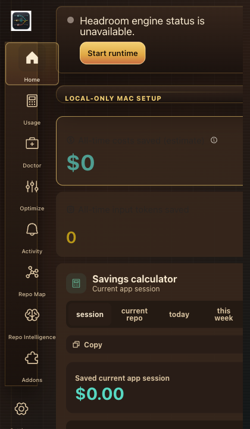
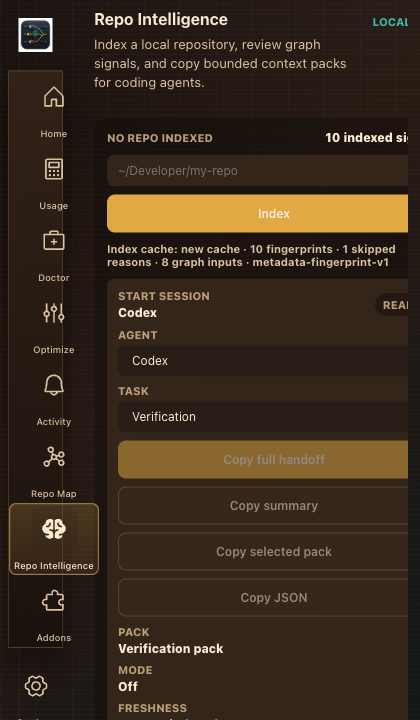
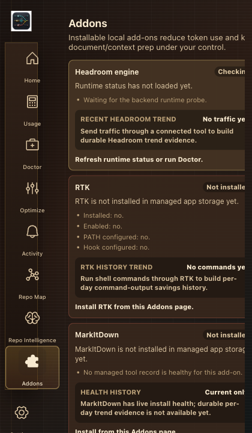

# Mac AI Switchboard

**A local-first Mac menu bar switchboard for Claude Code, Codex, Headroom, RTK, and copyable context packs for other coding agents.**

## Current Feature Snapshot

Mac AI Switchboard now ships as more than a routing toggle. The current `main` branch includes:

- **One-click optimization modes**: Full optimization, Headroom only, RTK only, and Off, with reversible Doctor repair flows.
- **Codex + Claude routing**: managed local routing through Headroom where supported, with oversized-turn safety handling and Codex repair guidance.
- **Prompt-cache optimization groundwork**: provider cache metric parsing, cache-read ratio calculation, stable-prefix ordering, and optimization snapshots.
- **Preemptive compaction planning**: threshold-based compaction decisions before oversized requests turn into hard 413 failures.
- **Repo Intelligence + Agent Session packs**: local repository indexing, copyable context packs, agent handoffs, freshness warnings, CLI exports, and read-only MCP documentation.
- **Savings attribution**: RTK command-output savings, Repo Intelligence token-avoidance estimates, add-on attribution rows for MarkItDown, Ponytail, Caveman, and Compact Chinese profiles.
- **Redundancy/model-routing primitives**: backend modules for duplicate payload detection and cheaper-model routing policy decisions.
- **Retro switchboard UI**: the menu bar app now has a compact switchboard-style theme with brass controls, visible scroll behavior, and menubar-width layout fixes.

Still in progress: notarized public release evidence, public installed-app smoke proof, full live Token X-ray, deeper live redundancy reporting, long-running Repo Memory MCP supervision, and durable runtime savings counters for every add-on.

## Current App Screenshots

These captures show the current menu bar UI surface and live setup/status panels.

| Switchboard status | Repo Intelligence / Agent Session | Add-ons / optimization stack |
| --- | --- | --- |
|  |  |  |

[](https://github.com/tarunag10/mac-ai-switchboard)
[](LICENSE)

## Main Page Index

Visible docs:
- [Plan status ledger](docs/plan-status-ledger.md)
- [Product roadmap plan](docs/product-roadmap-plan.md)
- [Agent Control Center implementation plan](docs/agent-control-center-implementation-plan.md)
- [Fable security implementation plan](docs/fable-security-implementation-plan.md)
- [Adapter lifecycle](docs/adapter-lifecycle.md)
- [Benchmarks](docs/benchmarks.md)
- [Repo map](docs/repo-map/README.md)
- [Repo map compact context](docs/repo-map/COMPACT_CONTEXT.md)

PR and release materials:
- [Pull request template](.github/PULL_REQUEST_TEMPLATE.md)
- [Alternate pull request template](.github/pull_request_template.md)
- [CI workflow](.github/workflows/ci.yml)
- [macOS CI workflow](.github/workflows/macos-ci.yml)
- [Rust/Tauri workflow](.github/workflows/rust-tauri.yml)
- [Release macOS workflow](.github/workflows/release-macos.yml)
- [Release macOS staging workflow](.github/workflows/release-macos-staging.yml)
- [Security workflow](.github/workflows/security.yml)
- [Test workflow](.github/workflows/test.yml)
- [Vendor wheel build workflow](.github/workflows/build-vendor-wheels.yml)

Mac AI Switchboard is a privacy-first Mac utility for turning local coding-agent optimizations on and off. It manages supported client routing, shell-output compression, local add-ons, Doctor repairs, and read-only repo context packs from one app.

The app is **local-first**, not offline-only. Claude, OpenAI, and other provider model calls still go to the configured remote APIs. Switchboard state, reversible client config edits, Doctor repair data, add-on setup, telemetry defaults, and Repo Intelligence metadata stay on your Mac.

Current status: active productization branch. The standalone repository is public, but signed release artifacts are not published yet. Build from source for now.

For local development, run `npm run app:run` or use the Codex desktop **Run** action. Both point at `script/build_and_run.sh`, which stops any existing app process and launches the Tauri development build. Use `script/build_and_run.sh --verify` when you want a one-command launch health check.

## Roadmap Checkpoint

Created so far: Start Agent Session, Claude/Codex managed routing, one-click Claude/Codex connector verification prompts, bounded Gemini/OpenCode adapter work, managed connector sidecar coverage, read-only Repo Intelligence APIs, expanded lightweight symbol parsing, repo-memory MCP lifecycle/supervision evidence, savings attribution ledger, safe config dry-runs, Doctor timeline/repair copy, Rollback Center native restore/cleanup, guarded native undo-all for ready rollback rows, release-readiness evidence surfaces, Caveman profiles including opt-in Compact Chinese, and trust-hardening guards for remote destinations, local-only account flows, external links, and app-owned branding.

Still left: provider-specific native config writes beyond sidecars, real long-running repo-memory MCP process supervision, deeper tree-sitter/language-aware Repo Intelligence graphs, stronger measured counters for add-ons where runtime evidence exists, user-approved safe config writes with verification/rollback, relaunch-survival evidence for Rollback Center, signed/notarized public DMG evidence in-app, and remaining legal/privacy/network-audit/public-release hardening.

## What It Controls

| Tool or area                                                                      | Status                  | Automatic routing | RTK support | Repo packs | Notes                                                                                       |
| --------------------------------------------------------------------------------- | ----------------------- | ----------------: | ----------: | ---------: | ------------------------------------------------------------------------------------------- |
| Claude Code                                                                       | Managed                 |               Yes |         Yes |        Yes | Reversible config edits and hook setup.                                                     |
| Codex                                                                             | Managed                 |               Yes |     Partial |        Yes | Provider block, direct-bypass handling, and Doctor repair flows.                            |
| Headroom                                                                          | Core runtime            |               Yes |          No |         No | Local optimization proxy used by managed clients.                                           |
| RTK                                                                               | Core add-on             |                No |         Yes |         No | Command-output compression for shells and agent tool output.                                |
| Repo Intelligence                                                                 | Supported               |                No |          No |        Yes | Read-only repo summaries, context packs, and agent handoffs.                                |
| Gemini CLI                                                                        | Limited managed adapter |           Limited |          No |        Yes | Shell/base-url routing adapter exists; provider/account mutation remains gated.             |
| OpenCode                                                                          | Limited managed adapter |           Limited |          No |        Yes | Provider adapter work exists; lifecycle gates still decide native writes.                   |
| Cursor                                                                            | Guided                  |                No |          No |        Yes | Copyable packs and settings detection today.                                                |
| Windsurf                                                                          | Guided                  |                No |          No |        Yes | Copyable packs and settings detection today.                                                |
| Goose | Managed MCP | Yes | No | Yes | Read-only Repo Memory MCP bridge with provider/model routing still manual. |
| Aider, Continue, Qwen Code, Amazon Q Developer CLI, Zed AI, Grok / xAI CLI | Detected or planned | No | No | Yes | Manual workflow, detection evidence, and automation gates until reversible setup is proven. |
| MarkItDown, Ponytail, Caveman                                                     | Add-on                  |                No |     Depends |         No | Local helper add-ons with explicit install/disable flows.                                   |

See [Connector Support](docs/connectors.md) for the status vocabulary and per-tool guardrails.

## Switchboard Modes

| Mode              | What It Does                                                                                    | Typical Use                                                                             |
| ----------------- | ----------------------------------------------------------------------------------------------- | --------------------------------------------------------------------------------------- |
| Full optimization | Routes supported clients through Headroom and enables RTK shell-output compression.             | Daily coding-agent work with the full local optimization layer.                         |
| Headroom only     | Routes supported clients through the local Headroom proxy while leaving shell output unchanged. | Prompt/context optimization without shell command rewriting.                            |
| RTK only          | Keeps LLM traffic direct and enables RTK shell-output compression.                              | When a client should bypass Headroom or a large Codex request hits compression refusal. |
| Off               | Removes local routing hooks and disables RTK integration.                                       | Clean pass-through mode before debugging client config or comparing behavior.           |

Switchboard separates **requested mode** from **active mode**. If a mode is requested but a dependency is missing, the app shows the active subset and points you to Doctor.

Doctor currently repairs:

- Headroom runtime reachability.
- Reversible Claude Code and Codex setup for supported installed tools.
- RTK installation and shell integration.
- Codex oversized-turn preflight that routes around Headroom before `413 compression_refused`.
- Repo Intelligence stale or missing index warnings.
- Repo Memory MCP configuration for read-only agent access to Repo Intelligence packs.
- Managed connector status, dry-run evidence, and safe manual workflow guidance.

For real-world Codex compression failures such as:

```text
unexpected status 413 Payload Too Large: compression_refused
```

Switchboard preflights oversized Codex turns and routes them around Headroom before a compression refusal. Doctor still exposes Reset Codex for stale fallback direct-routing state. See [Codex Compression Troubleshooting](docs/codex-compression-troubleshooting.md).

If Codex instead reports:

```text
The '' model is not supported using Codex with a ChatGPT account.
```

that is a Codex model/provider configuration problem, not the usual Headroom compression path. Use Doctor to re-apply the managed Codex provider block, then choose a Codex-supported ChatGPT model before retrying.

## Local Tools

### Headroom

Headroom is the managed local optimization runtime used by Switchboard for proxy routing and prompt/context compression. Switchboard installs it into app-owned storage and controls whether supported clients route through it.

The app identity is **Mac AI Switchboard**. New primary app storage is:

```text
~/Library/Application Support/Mac AI Switchboard
```

On first launch after upgrading from older builds, Switchboard copies legacy `~/Library/Application Support/Headroom` storage into the new app storage path and records `config/migrations.json`. The legacy directory is preserved for one-release compatibility with existing runtimes, logs, receipts, backups, cleanup paths, and reversible client setup state.

### RTK

RTK is the local command-output compression layer. Switchboard can make it available in supported shells and agent workflows so large command output is reduced before it reaches a context window.

This repository also uses RTK for contributor commands. See [AGENTS.md](AGENTS.md) for the local command prefix used in this checkout.

### MarkItDown

MarkItDown is an optional local add-on for converting PDFs and Office documents into cleaner Markdown before an agent reads them. It is useful when you want document context without pasting large raw files into a chat.

### Ponytail

Ponytail is an optional local add-on that nudges coding agents toward smaller, less over-engineered changes. It complements RTK and Repo Intelligence by reducing unnecessary implementation sprawl rather than compressing output after the fact.

### Caveman

Caveman is an optional prompt/profile layer for terse internal handoffs and command summaries. It includes scoped and aggressive profiles, plus an experimental opt-in Compact Chinese profile. Compact Chinese is limited to private internal planning notes and handoffs; user-facing, legal, safety, debugging, and release-readiness content stays in the requested language with full detail.

### Repo Intelligence

Repo Intelligence is a read-only local indexer and handoff generator. It scans a local repository, classifies files, estimates context size, summarizes implementation/test/config areas, and produces bounded packs for agents.

Read-only foundation: the app now ships a read-only foundation for local repo index, context packs, persisted summary, Doctor warnings, and clear/copy UI. Read-only local repo index, context packs, persisted summary, Doctor warnings, and clear/copy UI are available before any agent starts reading files. The CLI now exposes an agent-readable `--manifest` for agents that need to discover packs without rescanning the repo, plus `--session` for `mac_ai_switchboard.agent_session_preparation` payloads with freshness, task type, recommended mode, selected handoff, and managed connector readiness.

Useful commands:

```bash
npm run repo:intelligence -- <repo-path>
npm run repo:intelligence -- <repo-path> --manifest
npm run repo:intelligence -- <repo-path> --list-agents
npm run repo:intelligence -- <repo-path> --pack implementation --format markdown
npm run repo:intelligence -- <repo-path> --agent codex --format markdown
npm run repo:intelligence -- <repo-path> --session --agent codex --task verification --headroom-healthy --rtk-healthy --format markdown
npm run repo:intelligence -- <repo-path> --agent gemini --format json
```

Supported handoff targets include `claude`, `codex`, `gemini`, `opencode`, `aider`, `goose`, `cursor`, `continue`, `grok`, `qwen`, `amazonq`, `windsurf`, and `zed`. Default packs exclude secret-like paths such as `.env*`, private-key folders, certificates, and signing keys.

### Repo Memory MCP

Repo Memory MCP is the read-only agent-consumption surface for Repo Intelligence. It exposes context packs, symbol lookup, and dependent-edge queries to supported agents without modifying the repository. The app surfaces lifecycle status in Mode Inspector, provides an Install MCP action, and Doctor can repair missing Repo Memory MCP configuration. The release verifier includes `npm run check:repo-memory-mcp`.

Current repo-memory MCP supervision records app-session active state, last-check evidence, stale-config detection, and managed command health for the descriptor, repo-memory script, and Node entrypoint. Connector bridge setup recipes are documented for supported agents. Real long-running process supervision remains roadmap work.

See [docs/repo-memory-mcp.md](docs/repo-memory-mcp.md), [docs/repo-intelligence-plan.md](docs/repo-intelligence-plan.md), and [docs/architecture.md](docs/architecture.md).

## Savings And Attribution

Switchboard separates measured, estimated, and inferred savings instead of merging them into one opaque number.

- Headroom engine session deltas are now written as append-only measured attribution events and exposed through a read-only backend command.
- RTK reports command-output savings through its own gain/today stats and measured backend attribution events.
- Repo Intelligence records estimated best-pack token-avoidance events after successful index builds.
- MarkItDown, Ponytail, Caveman, and Compact Chinese record durable inferred template events when enabled until each source has stronger measured runtime counters.
- Savings ledger exports include confidence labels, evidence, caveats, and attribution percentages by confidence.

## What It Changes On Your Mac

Switchboard is designed to be reversible and explicit. Depending on mode and installed tools, it may write:

- `~/Library/Application Support/Mac AI Switchboard` for managed runtimes, tools, logs, receipts, backups, caches, and Repo Intelligence summaries.
- `~/Library/Application Support/Headroom` may remain as preserved legacy storage after migration.
- `~/.claude/settings.json` and `~/.claude/hooks/` when Claude Code routing or RTK hooks are enabled.
- `~/.codex/config.toml` and shell profile managed blocks when Codex routing is enabled.
- macOS Keychain entries for app/session secrets.
- `~/Library/LaunchAgents/` only if launch at login is enabled.

Managed config blocks are fenced with `# >>> headroom:... >>>` markers and backups are written before edits where client configuration is changed.

Rollback Center inventories every managed local footprint with targets, markers, backup expectations, restore mode, evidence requirements, and Off-cleanup boundaries. It also provides guarded execution previews with undo-all order and exact confirmation phrases.

Native rollback execution is currently allowlisted for Codex/OpenCode backup restores, Gemini managed cleanup, and sidecar-backed cleanup rows for Cursor, Grok/xAI CLI, Aider, Continue, Goose, Qwen Code, Amazon Q Developer CLI, Windsurf, and Zed. The guarded native undo-all flow executes only ready allowlisted rows and leaves manual or dedicated cleanup rows blocked.

Off mode removes routing hooks and RTK integration. Runtime files, logs, receipts, and keychain entries remain so the next launch is fast. Uninstall cleanup is covered in [docs/install.md](docs/install.md).

See [Threat Model](docs/threat-model.md) for the local proxy bind/auth boundary, raw-message logging limits, and future hardening plan.

## Installing

Normal users will install a signed DMG once releases are published:

1. Download `Mac-AI-Switchboard_<version>.dmg` from GitHub Releases.
2. Drag **Mac AI Switchboard** into **Applications**.
3. Launch the app and approve local runtime install on first run.
4. Choose **Full optimization**, **Headroom only**, **RTK only**, or **Off**.

Until signed DMGs are published, build from source:

```bash
git clone https://github.com/tarunag10/mac-ai-switchboard.git
cd mac-ai-switchboard
npm install
cat > .env <<'EOF'
HEADROOM_LOCAL_ONLY="1"
VITE_HEADROOM_LOCAL_ONLY="1"
VITE_HEADROOM_REMOTE_TELEMETRY="0"
EOF
npm run tauri dev
```

See [docs/install.md](docs/install.md) for the current install and smoke-test checklist.

For a local Mac-only unsigned test build, run:

```bash
npm run build:mac:local-install
```

Unsigned DMGs are local build output under `src-tauri/target/release/bundle/dmg/`. They are useful for internal testing, but they are ignored by git and should not be treated as public release artifacts.

The local install command installs, ad-hoc signs, smoke-checks, and opens `/Applications/Mac AI Switchboard.app`. For automation that should not open the app window, run `MAC_AI_SWITCHBOARD_SKIP_OPEN=1 npm run build:mac:local-install`.

## Development

```bash
npm install
npm run tauri dev
```

Local-only builds should use:

```bash
HEADROOM_LOCAL_ONLY="1"
VITE_HEADROOM_LOCAL_ONLY="1"
VITE_HEADROOM_REMOTE_TELEMETRY="0"
```

Remote telemetry, support, and update services are off by default. Mac AI Switchboard does not include a remote account, billing, checkout, or paid pricing API.

Useful checks:

```bash
npm run test:all
npm run smoke:preflight
npm run release:ready -- --json
cargo test --manifest-path src-tauri/Cargo.toml
```

Clean Rust build artifacts when needed:

```bash
cargo clean --manifest-path src-tauri/Cargo.toml
```

## Repository Map

```text
src/                         React + Tauri frontend
src-tauri/src/lib.rs         Tauri commands, tray wiring, modes, Doctor, updates
src-tauri/src/state.rs       App state and dashboard shaping
src-tauri/src/tool_manager.rs Managed runtime and tool installation
src-tauri/src/client_adapters.rs Client detection and reversible setup
src-tauri/src/repo_intelligence.rs Read-only repo indexing and context packs
src/lib/managedChanges.ts Rollback Center inventory, dry-run, and execution-preview contracts
src/lib/savingsCalculator.ts Savings ledger display helpers
src-tauri/src/insights.rs    Local recommendations
scripts/                     Release, smoke, repo-intelligence, and validation helpers
docs/                        Architecture, install, release, troubleshooting docs
research/                    Tool compatibility and planning notes
```

## Release Flow

Updates ship outside the App Store through Tauri's updater and GitHub Releases. Local DMG builds and release workflows run validation before artifacts are published. See [docs/macos-release.md](docs/macos-release.md).

Maintainer commands:

```bash
npm run build:mac:dmg
npm run release:ready -- --strict
npm run smoke:installed -- --confirm
```

Use `./scripts/bump-version.sh <version>` to update version files together. `main` is the stable channel, `staging` is the release-candidate channel, and stable promotions should land through release PRs after staging validation.

## Dependency Pinning

Managed tools are pinned so users get one known-good version per desktop release. Automatic background upgrades are disabled.

`headroom-ai` is controlled in [src-tauri/src/tool_manager.rs](src-tauri/src/tool_manager.rs) by:

- `HEADROOM_PINNED_VERSION`
- `HEADROOM_PINNED_WHEEL_URL`
- `HEADROOM_PINNED_SHA256`

RTK, Python standalone runtime, vendor wheel indexes, MarkItDown, and Ponytail follow the same release philosophy: pinned versions, explicit checksums where applicable, and upgrades through desktop app releases rather than surprise background changes.

## License, Governance, Branding, Contributions

Source code is MIT-licensed. Official app names, icons, signing identities, update endpoints, release artifacts, and distribution channels are not licensed for reuse. Forks should use their own app name, bundle identifier, signing identity, and update channel.

Public contributions are welcome, but no pull request from another person, bot, fork, dependency-update service, or external contributor should be merged unless Tarun Agarwal explicitly approves it.

See [GOVERNANCE.md](GOVERNANCE.md), [MAINTAINERS.md](MAINTAINERS.md), [CONTRIBUTING.md](CONTRIBUTING.md), [SECURITY.md](SECURITY.md), [PRIVACY.md](PRIVACY.md), [TERMS.md](TERMS.md), [CODE_OF_CONDUCT.md](CODE_OF_CONDUCT.md), [SUPPORT.md](SUPPORT.md), [TRADEMARKS.md](TRADEMARKS.md), [NOTICE](NOTICE), [docs/remote-destinations.md](docs/remote-destinations.md), and [docs/repository-settings.md](docs/repository-settings.md).
