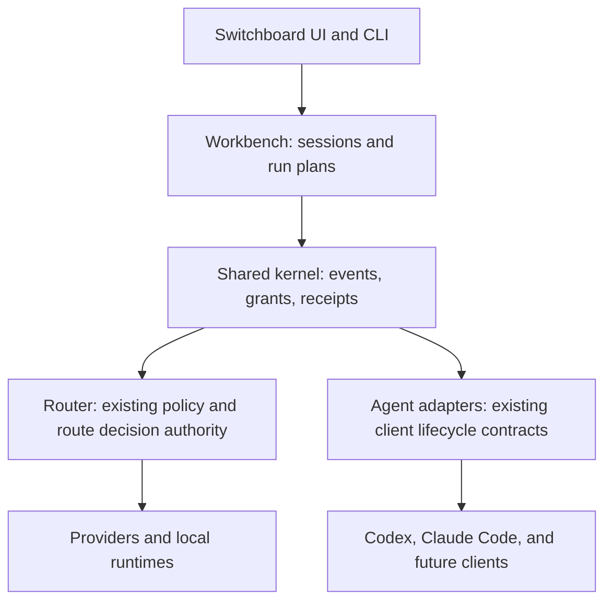

# Switchboard Router and Workbench implementation plan

Updated: 2026-08-24

## Product decision

AI Switchboard has two first-class product surfaces backed by one kernel:

- **Switchboard Router** is the local, headless routing and optimization layer.
  It remains usable from existing coding clients and other local applications
  without starting an agent loop.
- **Switchboard Workbench** is the all-in-one control surface for sessions,
  agent-run plans, capability grants, tools, replay, and eventually managed
  execution. It calls the Router as a capability; it never replaces or runs a
  second routing policy.



The Workbench starts **non-autonomous**. It may create and replay local plans,
but cannot launch a shell, call a provider, modify a workspace, or persist a
prompt/tool result until a later execution backend passes its own consent,
redaction, rollback, and release gates.

AI Switchboard is developed for private research and published as open source;
no commercial or monetary use is intended. This project intent does not erase
upstream copyright, licence, NOTICE, dependency, model, patent, or trademark
conditions. The distribution target is self-contained: supported capabilities
must be Switchboard-native or bundled from an exact reviewed source revision,
without runtime downloads, host checkouts, or mutable `latest` dependencies.

## Audit basis and status vocabulary

This status was reconciled against committed `main` through `53052e7d` plus the
fixed-location Codex metadata collector recorded with this update, and against
the visible frontend/native command wiring on 2026-08-24. Unrelated concurrent
unstaged work is not counted as shipped. A check mark therefore means the
capability is in the committed product boundary, not merely described in
another plan or present in an unrelated local diff.

- **Done** — implemented on `main`, reachable through its intended product
  surface, and covered by focused deterministic checks.
- **Prepared / partial** — useful contracts, UI, or receipts exist, but they do
  not yet perform the end-to-end user outcome.
- **Remaining build** — implementation and tests are still required.
- **Intentionally gated** — the safe behavior is to remain unavailable until
  the named evidence or consent gate passes.
- **External gate** — completion depends on a pinned upstream runtime,
  licence/compatibility evidence, provider access, or release environment that
  this repository must not fabricate.

Current verification snapshot:

- `19` focused Workbench bridge/view tests pass, including historical receipt
  visibility and late-plan invalidation.
- `96` focused native `workbench_kernel` tests pass, including `14` fake
  process-controller lifecycle/restart/CAS tests and `5` deterministic
  verified-routing admission-orchestration/expiry tests plus `10` fixed Codex
  catalog/probe-contract tests and `17` fixed-location collector tests.
- Selective activation recovery passes `12` focused frontend tests and `15`
  native activation-command tests; no recovery path automatically retries or
  reapplies a tool.
- The model-routing evidence gate passes: `13` Node contract tests, `35`
  native model-routing tests, and `18` native telemetry-store tests.
- `npm run build` passes after preserving the authoritative
  `RepoPackCompressionMode` union in the preference refresh.
- `npm run check:oss-harness-integrations` passes after its stale deleted
  registry-test reference was replaced with the shared Workbench projection,
  Addons integration, and native registry checks.

## Executive implementation status

| Area | Already done | Prepared or partial | Still left |
|---|---|---|---|
| Router authority | Observe-only route planning, endpoint eligibility, bounded task classes, native completion handles, redacted evidence, decision receipts, presets, and visible Routing UI | `userApproved` and `automaticAllowlisted` can be saved and deterministically evaluated, but the operational receipt truthfully reports effective `observe` | Bind one real request/session lifecycle to outcome evidence; then add per-request approved routing and, only after evidence, automatic allowlisted routing |
| Workbench kernel | Content-free durable sessions/events, lifecycle/fork/export, capability projection, replay/Router receipt resolution, adapter dry-run plans, containment intent, 15-minute grants, durable Codex admission, a fixed-location metadata collector, and a crate-only deterministic fake controller with current-grant revalidation, exact-byte CAS, launch-epoch recovery, bounded stream metadata, and terminal tombstones | The collector observes only seven fixed locations and the controller models lifecycle and persistence only; no version probe, task payload, workspace handle, PID, output, provider request, Tauri command, or actual process exists | Opt-in manual version harness, native supervisor, process ownership, real timeout/cancel, ephemeral task channel, workspace revalidation, execution receipts, recovery, and orchestration |
| Workbench UI | Navigation, session timeline, presets, plan inspection, grant/revoke, admission validation, session-level receipt history, derived current eligibility, expiry refresh, stale-response rejection, truthful no-traffic/no-write badges, and hidden-view refresh guard | Execution is deliberately absent and admissions remain immutable historical evidence | Add live run status/cancel/recovery only when the native supervisor exists; never add a renderer-owned shell or command field |
| Selective optimization | A production Addons card lets the user choose exactly five of ten tools and activate them in one click; native validation, preflight, single-run locking, per-tool results, receipts, drift-safe rollback, native selection hydration, and a sanitized restart recovery view cover the managed actions | A run can end `partial`; restart restores rollback access but never retries automatically | Expose bounded receipt history and add a checkpointed safe retry/resume design that cannot reapply successful tools or overwrite ownership |
| Ponytail | Six unmodified MIT skills from `4.9.0` commit `2ed6c52c9d7e5e56942508591085fd45dea277d3` are app-bundled with hashes and licence; the core profile uses Switchboard-owned client blocks and existing Addons/select-five/Doctor/rollback paths | A legacy Switchboard-owned marketplace receipt may need its old host CLI once to remove the app-owned plugin entry before migration; user-owned entries are preserved | Add disposable-home legacy migration tests and expose the five one-shot review/audit/debt/gain/help resources through future Workbench actions without reintroducing host plugins |
| Caveman, RTK, MarkItDown | Visible Addons and selective activation paths; exact created/changed artifact fingerprints; narrow restore/removal; external-drift blocking; receipt preservation | RTK and MarkItDown still install managed external artifacts; client prerequisites can fail on a particular machine | Add end-to-end disposable-home matrix tests, app-visible repair for partial runtimes, and complete their separate source-bundling phases |
| Switchboard Pack Compaction | The deterministic no-model adapter, read-only pack preference, selective activation, native readiness, source spans, hashes, and zero-wrong-omission gate are Switchboard-owned | Persisted mode/tool ID `chonkify` remains accepted only for backwards compatibility | Keep the compatibility alias out of user-visible copy and never attribute this implementation to upstream Chonkify |
| Leanctx | Loopback-only shadow setup and selective activation/rollback are visible | Requires an already configured executable despite UI copy saying install-and-enable; remains shadow-only | Correct the copy, pin a supported runtime/version if distribution is desired, and pass health/containment/promotion evidence before live routing |
| OSS harness reuse | Internal pinned DeepSeek Harness preview adapter, maturity audit/context prototype, redacted replay, deterministic strategy fixtures, session-event prototype, and shared metadata-only registry | DeepSeek is not in the normal connector UI; Switchyard and JCode are evaluated references; `twaldin/harness` contributes only a contract idea | Expose DeepSeek honestly as Experimental or remove prototype-only production modules; then choose and prove one optional pinned workflow |
| UI visibility | Workbench and Routing are top-level routes; selective activation is in Addons; advanced Headroom settings are in Settings; the shared support/quit footer is mounted with visible native-command errors; the assembled-app route test now includes Workbench; inactive routes use `hidden` as navigation state rather than product concealment | Some controls correctly remain disabled because their backend is absent or unsafe | Extend reachability from top-level routes to production components and ensure every mounted hidden route suspends polling/subscriptions |

The largest product gap is therefore not another card or policy schema. The
fake controller now proves the narrow lifecycle/persistence contract, but the
remaining gap is the real native execution seam between a valid Workbench
admission and one owned, cancellable Codex child process. The largest Router
gap is the separate seam between observe-only decisions and a real request
completion lifecycle. Neither gap should be filled by exposing arbitrary
commands, paths, prompts, or provider credentials to the renderer.

## Current inventory

| Capability | Current authority | Status | Workbench action |
|---|---|---|---|
| Model/provider route policy and evidence thresholds | `src-tauri/src/optimization/model_routing.rs` | Done as a pure planner/gate | Reuse as the Router authority; live model substitution is not implemented. |
| Endpoint/route plan and transport observations | `src-tauri/src/route_plan.rs`, `transport_observations.rs` | Planner and live observations done; lifecycle correlation open | Reuse their content-free evidence; call the route planner from one live shadow path before any substitution. |
| Coding-client detect/plan/consent/apply/verify/rollback | `src-tauri/src/client_adapter_contract.rs` | Done | Wrap as a planning adapter; keep it the only configuration mutation authority. |
| OSS strategy fixtures and redacted route replay | `oss_harness_replay.rs`, `scripts/oss-harness-strategies.mjs` | Done | Promote their schema into the kernel event/replay boundary. |
| Session-event prototype | `scripts/oss-session-events.mjs` | Done, prototype | Port its contiguous lifecycle/fork rules to native persistent storage. |
| Context packs and agent memory | `src/lib/agentSessionPacks.ts`, `src-tauri/src/agent_memory/` | Done, bounded | Reference pack IDs/digests only; do not persist prompts or source content. |
| OSS capability metadata/promotion gate | `oss_capabilities.rs`, `plugin_promotion_gate.rs` | Done, metadata only | Project from Kernel registry/grants while retaining fail-closed promotion. |
| Selective activation receipts | `activation_commands.rs` | Done | Use the same ownership/rollback model for future capability changes. |
| Durable Workbench session/run authority | `src-tauri/src/workbench_kernel/` | Done, plan-only | Persist opaque sessions and prepare non-executable router/adapter plans. |
| Process authorization and admission | `capability_grant.rs`, `process_supervisor.rs` | Prepared, non-executing | Revalidate a plan, issue/revoke a fixed-expiry grant, and record Codex `authorized_not_started`; do not describe this as process supervision. |
| Fake process lifecycle controller | `process_controller.rs` and its focused submodules | Done as deterministic no-process infrastructure | Revalidate the durable grant ledger at start, persist content-free state with exact-byte CAS, preserve same-launch ownership, orphan changed-launch active receipts once, reclaim terminal receipts with non-resurrectable tombstones, and keep this crate-only until a separate real-executor gate passes. |
| Select-five optimization UI | `SelectiveActivationCard.tsx`, `activationTools.ts` | Done, restart follow-up open | Keep exactly five of the ten explicit tools and show each native result; add native last-receipt recovery. |
| DeepSeek Harness preview adapter | `deepseek_harness.rs`, `dsh_plugin_maturity.rs` | Prepared, internal experimental pin | Expose its normal consent/verify/rollback lifecycle as an explicit Experimental connector or remove production-only prototypes; retain guided-only fallback for unknown versions. |
| Real agent execution backend | — | Remaining build, deliberately gated | Add only after the non-autonomous kernel and UI are verified. |

## OSS reuse and provenance policy

| Upstream | Licence/state | Reuse | Explicit non-reuse |
|---|---|---|---|
| [DeepSeek Harness](https://github.com/deepseek-ai/deepseek-harness) | MIT; developer preview with breaking-change risk | First vendor reviewed, dependency-free content-free contracts; later bundle only the locked runtime subset that passes the same kernel gates | No wholesale scheduler/credential flow import and no automatic execution. |
| [NVIDIA NeMo Switchyard](https://github.com/NVIDIA-NeMo/Switchyard) | Apache-2.0; pre-alpha | Vendor selected pure protocol-translation modules with the Apache licence, upstream NOTICE, modification record, and golden fixtures | No second live router, embedded server, automatic install, or configuration rewrite. |
| JCode provenance conflict: [plan target](https://github.com/Ravi-bit-app/jcode), [evaluation target](https://github.com/1jehuang/jcode) | Unresolved; local documents name different repositories | Attach/resume, multi-session lifecycle, adaptive context and resource profiling ideas only | No source, binary, attribution, or claimed pin until one repository/commit/licence is selected and the other reference is corrected. |
| [twaldin/harness](https://github.com/twaldin/harness) | Evaluate and pin before any dependency use | `RunSpec -> RunResult` adapter boundary and per-CLI isolation | No subprocess execution or instruction-file mutation in the initial kernel. |

Every future OSS addition needs: pinned URL/commit, licence and attribution,
compatibility matrix, capability declaration, privacy/redaction review,
rollback/disable path, deterministic tests, and a visible UI disclosure. The
existing `plugin_promotion_gate.rs` remains the promotion authority.

The authoritative current-state and target-state ledger is
`third_party/oss-integrations.json`; `THIRD_PARTY_NOTICES.md` is the committed
notice index. The inventory gate rejects a self-contained-complete component
that still needs an external runtime or runtime download. Full upstream licence
files and exact copyright notices must enter the app bundle in the same commit
that first copies the corresponding source or binary.

## Kernel contracts

```text
workbench_kernel/
  session.rs            durable content-free identity, status, lineage, timestamps
  events.rs             bounded versioned lifecycle ledger and deterministic forks
  run_contract.rs       RunSpec, RunPlan, Router/replay references, capabilities
  presets.rs            native-owned observe-only plan drafts
  adapter_readiness.rs  process-free canonical adapter metadata
  process_run_spec.rs   deterministic future-containment intent, never a command
  capability_grant.rs   expiry-bound future-process authorization receipts
  process_supervisor.rs durable historical admissions, not a process supervisor yet
  storage.rs            atomic local session persistence and bounded retention
```

Invariants:

- A session event contains only bounded identifiers, event kind, sequence,
  parent reference, local timestamps, route/adapter/capability IDs, and opaque
  digests. Prompts, model messages, outputs, headers, endpoint URLs,
  credentials, filesystem paths, and tool arguments are forbidden.
- Session events are contiguous, append-only, bounded, and transition through
  `active -> paused -> active|completed|cancelled`; forking is explicit and
  deterministic.
- A `RunSpec` is declarative and non-executable by default. It holds an
  existing workspace/reference digest, adapter ID, context-pack digest, route
  decision reference, capability grants, and receipt IDs—not content.
- `RunPlan` may expose configuration dry-run evidence from the existing
  `CodingClientAdapter` contract but cannot apply it. Existing adapter consent
  and rollback rules remain unchanged.
- Capability requests are default-deny, session scoped, visible in the UI, and
  non-executable. The first expiry-bound, content-free future-process
  authorization receipt is locally recorded and revocable; it is not an
  execution endpoint and does not alter `ProcessRunSpec` authorization.
- The Router has one decision owner: existing model routing. A Workbench plan
  may link to the decision but cannot alter a live provider request.

## Phased delivery

### Phase 0 — foundations already shipped — Done

- [x] Local Router policy/planner, observe-only route plans, model-routing
  evidence, and live content-free transport observations. Live model
  substitution is not part of this completed foundation.
- [x] Client-adapter lifecycle contracts, config consent, verification and
  rollback.
- [x] Redacted replay, deterministic strategy fixtures, session-event
  prototype, static OSS metadata, and promotion gates.
- [x] Receipt-owned, drift-safe activation rollback for Headroom, RTK,
  Ponytail, Caveman, Leanctx, Switchboard Pack Compaction, MarkItDown, and
  master native add-ons.
  MarkItDown rollback removes only run-created artifacts after their exact
  post-activation fingerprints match; broad Addons cleanup remains explicit.
The stored `chonkify` mode and tool ID are backwards-compatibility values for
Switchboard Pack Compaction. Upstream Chonkify is not integrated or embedded.

### Phase 1 — consolidated architecture and provenance — Done

Deliverables:

- [x] This single Router/Workbench architecture and OSS-reuse plan.
- [x] Explicit reuse/non-reuse decision for DeepSeek Harness, Switchyard,
  JCode, and a unified CLI-harness contract reference.
- [x] Link this plan from the master implementation ledger.

Acceptance: the plan names one authority for routing, client mutation,
promotion, and rollback; no external runtime is silently copied or enabled.

### Phase 2 — native Workbench Kernel — Done

Deliverables:

- [x] `WorkbenchSession` ledger with atomic persistence, retention cap,
  migration/version rejection, content-free validation, and deterministic
  `forkAtEvent` lineage.
- [x] Typed `WorkbenchEvent`, `RunSpec`, `RunPlan`, `CapabilityRequest`, and
  `RouterDecisionReference` contracts.
- [x] Native commands to create, inspect, transition, fork, and export an
  observe-only session/run plan.
- [x] Projection of the existing static OSS registry and client-adapter dry
  run into the kernel without duplicate configuration logic.
- [x] Rust tests for forbidden keys, transition failures, persistence,
  idempotency, retention, and adapter/router boundary failures.

Acceptance met: a user can create, inspect, transition, fork, list, and
prepare an inspectable local plan without provider traffic, shell launch,
workspace mutation, or secret/content persistence. The visible UI follows in
Phase 3.

### Phase 3 — visible Workbench core UI — Done

Deliverables:

- [x] Workbench navigation surface beside Routing, with visible plan-only,
  provider-traffic, and write-state badges.
- [x] Content-free session creation, selection, timeline, explicit lifecycle,
  deterministic latest-event fork, and copy-only ledger export controls.
- [x] Observe-only Router decision references, adapter dry-run plans, bounded
  capability request controls, and truthful desktop/empty/error states.
- [x] Focused UI/bridge tests for navigation, loaded state, digest-only input,
  plan preparation, and the absence of an execution control.

Acceptance met: the non-autonomous Workbench kernel is visible and usable from
the desktop UI; unavailable execution is labelled as unavailable rather than
hidden.

### Phase 3.1 — Router and replay receipt integrity — Done; runtime provenance open

Deliverables:

- [x] Native observe-only completion handles atomically persist redacted
  metrics and one durable Router decision receipt. The receipt has an opaque
  ID, bounded metadata, and a SHA-256 digest over canonical content-free
  metrics; prompts, raw task text, responses, paths, provider payloads, and
  replay inputs remain excluded. Current success, cost, quality, latency, and
  rework metrics are entered through the evidence UI; their provider-request
  provenance is not yet automatic.
- [x] Bounded native list and resolver commands return only receipt-backed
  decisions. A manually recorded evidence event, replay digest, unknown ID,
  missing source event, altered receipt, or malformed policy fails closed.
- [x] The Router evidence screen visibly reports a completed receipt, and the
  Workbench replaces manual Router ID/digest fields with a native picker. Plan
  preparation resolves the selected ID again in Rust rather than trusting the
  renderer.
- [x] Replace the Addons-local OSS registry fetch with the typed shared
  Workbench projection. Native equality and UI tests preserve provider/tool
  labels and fail-closed plan-only/no-traffic/no-write state; registry rows
  remain display-only and cannot trigger Addons lifecycle actions.
- [x] Reuse the existing native redacted-replay validator as the sole parser,
  then issue a separate bounded content-free replay receipt. Its atomic local
  ledger contains only an opaque ID, validation time, counts, fixed
  observe-only flags, and verifiable source/receipt digests—never a path, raw
  event, task class, route/outcome data, prompt, response, or credential.
- [x] Add native replay receipt list/resolve commands and a Workbench picker
  that sends only `replayReferenceId`; native plan creation resolves it again,
  includes it in the plan digest, and rejects capability/receipt mismatches or
  caller-supplied replay metadata. Replay remains provider-free, plan-only,
  non-promoting, and non-executable.
- [x] Add native-owned Router and Workbench presets only as inspectable drafts:
  Router presets load existing observe-only policy into the form without saving;
  Workbench presets compose only existing Router/replay receipts and adapter
  plan capabilities. Preset evidence source, no-write/no-traffic state, and
  plan-only execution state are visible. Presets cannot issue handles, validate
  routes, promote routes, save policy, or execute a plan.
- [x] Harden Workbench plan contracts so every plan declares the existing
  `router_observe` and `client_adapter_plan` capabilities, while replay and
  repository-context capabilities are paired exactly with their native receipt
  or digest inputs. Native preset IDs must resolve and match their capability
  composition exactly.

Acceptance met for integrity and composition: an observe-only Router completion
supplies a digest-verified durable Workbench selection without creating a
second Router or exposing route content. It does **not** yet prove that manually
entered outcome metrics came from a specific intercepted request. A separately
verified redacted replay can be selected with the same native re-resolution
boundary; presets are native-issued plan/policy drafts with no promotion path.

Gate: do not collapse existing Addons, Router, or replay authorities into a
new Workbench copy. Each remaining link must retain its current promotion and
rollback rules.

### Phase 3.2 — live Router lifecycle binding — Remaining build

Deliverables:

- [ ] Call the canonical route-plan authority from one real, bounded proxy or
  session request path. Today `build_route_plan()` is contract/test-only and
  always returns `ObserveOnlyShadow`.
- [ ] Issue a request-bound decision ID before forwarding and complete it with
  native transport/model identity, cost, and latency evidence after the same
  request ends. Quality and follow-up rework must remain explicit benchmark or
  user evidence; they must not be inferred from HTTP success.
- [ ] Use one native Router run identity across ingress, policy decision,
  selected transport, provider completion, and evidence receipt. Do not close
  one transport observation and open an uncorrelated later observation.
- [ ] Reject mismatched, duplicate, expired, or incomplete request/completion
  pairs and preserve the existing content-free event boundary. Add a SQLite
  uniqueness constraint and immediate transaction around evidence validation,
  retention, and insertion so concurrent completions cannot race.
- [ ] Keep the selected live model equal to the requested model throughout the
  initial shadow period. Compare the runtime receipt with the existing manual
  harness before deprecating manual capture.
- [ ] Add a per-request `userApproved` execution path only after the shadow
  receipt proves correct binding and rollback. Replace the policy engine's
  Boolean approval input at the live boundary with a one-shot native receipt
  bound to run, baseline/candidate model, endpoint, policy digest, required
  capabilities, cost/timeout ceilings, expiry, and exact attempt.
- [ ] For substitution, select and canonicalize the candidate model first, then
  choose an endpoint that supports that exact model and its context/tool/vision/
  streaming requirements. Fail closed if model and endpoint cannot be proven
  together.
- [ ] Add `automaticAllowlisted` only after trusted evidence includes freshness,
  model/version/endpoint identity, paired or randomized samples, confidence
  bounds, canary percentage, daily cost budget, drift detection, automatic
  demotion, and receipt-owned return to observe-only.

Acceptance: a captured Router outcome can be traced to exactly one native
request lifecycle without storing request or response content, and observe mode
never substitutes the requested model.

### Phase 4 — execution adapter readiness — In progress, gated

Deliverables:

- [x] Metadata-only Codex and Claude Code compatibility matrix: fixed known
  candidate-location presence is returned without a path; CLI version state is
  explicitly `not_probed` because a version probe would start a process.
- [x] A command-builder-only `RunSpec -> RunPlan` readiness projection using
  the existing dry-run client adapter contract. It has a logical binary and
  adapter-plan ID only—no executable path, argv, shell, environment, working
  directory, instruction, timeout, prompt, credential, provider traffic, or
  start capability. Canonical `codex` and `claude_code` only are accepted.
- [x] A native-owned, content-free `ProcessRunSpec` is attached only to those
  command-ready plans. It is deterministically bound to the session, adapter
  plan, adapter contract, and workspace digest; records `not_started` and
  `not_granted`; and requires a future native fixed timeout, app-owned Unix
  process group, null stdin, bounded redacted output, and TERM-then-KILL group
  cleanup. It has no command path, argv, shell, environment, cwd, prompt,
  credential, PID/PGID, user-controlled timeout, process registry, or start
  endpoint.
- [x] An explicit, fixed-15-minute future-process authorization receipt is
  issued only after native re-preparation of the saved `RunSpec` exactly
  matches the displayed plan and containment IDs. The exact plan-bound phrase,
  active-session state, plan-only/no-traffic/no-write invariants, receipt
  digest, bounded local retention, expiry, terminal-session revocation, and
  manual revocation all fail closed. The UI exposes this receipt lifecycle and
  calls it non-executable; it cannot launch a CLI or change `not_granted`.
- [x] A visible, durable executor-admission receipt is limited to canonical
  Codex with already-verified existing routing. It re-prepares the submitted
  plan, requires the active bound grant, and records only
  `authorized_not_started`; it cannot resolve a binary, launch a child, apply
  configuration, access a workspace, or produce provider traffic.
- [x] Require `session.status == active` independently in both the admission
  command and core admission function. Terminal session state denies admission
  even if a pre-existing grant record still appears active.
- [x] Repeat active-session, exact process/admission binding, and current
  durable-grant/time revalidation immediately before the fake controller's
  `authorized -> starting` transition. A real executor must additionally load
  authoritative persisted session/admission/plan state and atomically consume
  or claim the grant at its final process-start boundary.
- [x] Make terminal transition and grant retirement fail-safe across the two
  ledgers, or make session state the authoritative denial and treat revocation
  as cleanup. The terminal transition now remains successful and authoritative
  when injected grant cleanup fails, and a focused test reloads the persisted
  terminal session.
- [x] Treat admission as a historical receipt, not current eligibility. Derive
  `active`, `expired`, `revoked`, `session_terminal`, and `superseded` status by
  rechecking the grant/session/plan; also represent `session_paused` and
  `unavailable` instead of forcing unsafe states into that five-state model.
  Stored `authorized_not_started` is never trusted as a launch capability.
- [x] Add `deny_unknown_fields` or equivalent explicit persisted-schema
  rejection for sessions, events, grants, and admissions, with corruption and
  forbidden prompt/path/credential/argv/output-field tests. Ledger envelopes
  also reject unknown fields rather than silently retaining future or injected
  content.
- [x] Add direct native `process_supervisor.rs` tests and bridge tests for
  valid/idempotent admission, paused/terminal session, expired/revoked/clock-
  rollback grants, plan drift, unknown adapter, corrupt digest, full ledger,
  restart, and concurrent issue attempts.
- [x] Add a deterministic command-orchestration seam for the already-present
  verified-routing prerequisite. Five fake-verifier/store tests prove verified
  routing persists one idempotent non-executing admission, false/error results
  persist nothing, invalid session/plan/grant prerequisites run before the
  verifier, the grant clock is evaluated after preparation and denies the exact
  expiry boundary, and `proxyReachable == false` is not confused with failed
  routing verification. Production still uses the canonical Codex adapter and
  the same public command.
- [x] Move authorization/admission history to a session-level receipt center,
  refresh at grant expiry, clear stale data on session changes/errors, and
  invalidate or freeze a prepared plan when any visible input changes. The UI
  keeps historical admissions separate from an ephemeral native eligibility
  snapshot and discards late plan responses by revision.
- [x] Add the pure fixed Codex catalog and probe-result evaluator. It separates
  incomplete, failed, absent-from-fixed-catalog, rejected, ambiguous, and
  present-but-unprobed snapshots; binds supplied version evidence to the same
  opaque binary identity
  before/after; and never reads the filesystem, starts a process, or claims the
  observed version is runnable, supported, admitted, or execution-enabled.
- [x] Add the fixed-location native collector. It observes exactly seven
  catalogued paths, rejects escaped/racy/special candidates, and emits only
  content-free identity metadata without starting a process.
- [ ] Add the opt-in manual version-probe harness. Runnable/supported validation
  remains gated on explicit manual evidence, launcher-chain containment, and a
  separately reviewed authoritative version policy.
- [x] Add a crate-only deterministic fake process registry and state machine.
  It performs no process, shell, network, provider, workspace, or Tauri action;
  persists only bounded content-free stream counters and digests; uses exact-
  byte compare-and-swap; distinguishes same-launch opens from changed-launch
  orphan reconciliation; and reclaims the oldest terminal receipt while
  retaining a non-resurrectable retired-run tombstone.
- [ ] Add actual bounded timeout/cancel enforcement, process ownership and
  reaping, receipt-backed cleanup, and a separately gated native executor. The
  current authorization/admission/fake-controller chain is intentionally
  insufficient to start or supervise a process.
- [x] Add deterministic fake-controller tests for lifecycle idempotency,
  invalid transitions, active-session/current-grant revalidation, bounded
  redacted stream metadata, capacity/reclamation/finality, restart epochs,
  corrupt content, stale writers, byte-only drift, deletion, and symlink
  substitution. A separate opt-in local manual process test remains gated.

Immediate Phase 4 order:

1. **4.1 Admission correctness — done** — active-session enforcement, cross-ledger
   failure handling, strict schemas, direct native/bridge tests, derived
   eligibility states, and bounded retention/reclamation.
2. **4.2 Receipt and consent UX — done** — session-level history, expiry refresh,
   immutable prepared-plan summary, input-change invalidation, and truthful
   historical-versus-current labels.
3. **4.3 Owned process controller — fake lifecycle foundation done; real
   controller remaining** — the deterministic no-process registry, current
   grant gate, state transitions, CAS persistence, restart epoch, terminal
   finality, and bounded content-free stream metadata are implemented. The
   Workbench-specific fixed Codex catalog, native fixed-location collector, and
   pure probe-result evaluator are done. Still add the opt-in manual probe,
   app-owned process group, null stdin, environment allowlist, bounded redacted
   buffers, fixed timeout, idempotent cancellation, reaping, and TERM-then-KILL
   cleanup. Reuse process-group and Leanctx shutdown ideas, not the generic
   runner's argument/stdout/stderr-bearing error surface.
4. **4.4 One-adapter opt-in executor** — canonical Codex only, behind a new
   explicit execution capability. Revalidate session, grant, admission,
   adapter/routing verification, binary identity, and workspace digest at the
   final start boundary.

Gate: no arbitrary shell, terminal, browser, provider, or workspace write can
be promoted without per-capability approval, process ownership, cancel/resume,
event redaction, rollback, and local/manual evidence.

### Phase 5 — guarded execution and orchestration — Remaining build

Deliverables:

- [ ] Opt-in local execution backend for one approved adapter at a time. The
  renderer chooses an adapter/task class, never a binary, shell, argv,
  environment, timeout, PID, or process group.
- [ ] Transient app-owned workspace handle that resolves an already selected
  directory only inside the native start boundary. Recompute and compare its
  identity/digest immediately before launch; do not persist the path in the
  content-free session ledger.
- [ ] Bounded ephemeral task envelope, separately consented and digest-bound to
  the grant/admission. Do not persist prompt/task text in session, grant,
  admission, telemetry, crash, or execution-receipt ledgers.
- [ ] Promote the tested fake run state machine (`starting`, `running`,
  `stopping`, terminal), immutable content-free receipt, launch-epoch
  reconciliation, and terminal finality into a real owned-process controller;
  then add stale-process cleanup and user-visible diagnostics that cannot
  disclose command output or credentials.
- [ ] Goal queue, bounded subagent scheduler, workspace lock/conflict model,
  and human approval checkpoints.
- [ ] Attach/resume/cancel and replay/fork semantics with execution receipts.
- [ ] Budget and concurrency limits, deterministic completion/failure tests,
  and visible per-session resource/evidence status.
- [ ] Separate capability grants for workspace read, workspace write, tool use,
  provider traffic, publishing, and external side effects. A process-start
  grant must never imply all of these capabilities.

Gate: subagents may propose or run only granted capabilities. They cannot
escalate privileges, publish, apply external changes, or absorb private prompt
content into the session ledger.

### Phase 6 — self-contained research OSS migration — In progress

- [x] One machine-readable OSS inventory records project intent, source
  repository, exact commit/version when known, licence evidence, current and
  target delivery modes, copied paths, notices, runtime/download ownership,
  migration state, and blockers. The aggregate OSS gate validates it.
- [x] A committed `THIRD_PARTY_NOTICES.md` index states the research-only
  project intent while preserving upstream obligations.
- [x] Correct the false Chonkify/MIT identity: the shipped implementation is
  Switchboard Pack Compaction, upstream code is not embedded, user-visible
  labels use the Switchboard name, and `chonkify` remains only a stored
  compatibility ID/CLI alias.
- [ ] Copy full upstream licence and NOTICE files into the app bundle in the
  same phase that each upstream source or binary is first bundled.
- [ ] A specific pinned DeepSeek/Switchyard/JCode workflow with compatibility,
  licence attribution, privacy, rollback, operational ownership and release
  evidence.
- [x] A dedicated Ponytail bundled profile is disabled by default and removable
  through a receipt-owned rollback.
- [ ] Resolve JCode's conflicting repository references before reuse; expose the
  existing DeepSeek adapter as an explicit Experimental connector with preview,
  consent, apply, verify, rollback, and separate configuration-versus-runtime
  health—or remove its prototype-only modules from the production graph.
- [x] Replace Ponytail `latest` with six reviewed, hash-checked bundled text
  resources, its full MIT licence, a native core-guidance integration, and
  receipt-compatible legacy cleanup without marketplace install or auto-update.
- [ ] Replace MarkItDown runtime PyPI installation with a minimal locked
  app-bundled wheel set; bundle leanctx's no-model core; build RTK from an exact
  reviewed source revision as an app sidecar; and classify Caveman as completed
  Switchboard-native guidance.
- [ ] Remove external runtime/download requirements from Headroom and the
  selected DeepSeek subset only after source-to-bundle hashes, licence closure,
  offline installation, rollback, and parity tests pass.

The existing DeepSeek adapter is the first experimental integration candidate:
it already pins `dsh 0.1.0-rc.5` and upstream commit
`47f943859bef60e4160492346772ded9b24f765a`, uses the normal adapter
plan/consent/apply/verify/rollback lifecycle, and becomes guided-only for an
unknown or ambiguous version. It must not silently become a Workbench executor.
Switchyard remains a selected-module protocol candidate, not a second router,
and JCode remains a session/context design reference until one exact repository
and commit are selected. Do not combine their routing authority with
Switchboard's Router.

## Prioritized improvements

| Priority | Improvement | Why it matters | Acceptance evidence |
|---|---|---|---|
| P0 — Admission done; execution gate remains | Enforce active session at admission/execution | A terminal session can be persisted before separate grant revocation fails | Injected cleanup failure proves the persisted session is authoritative for admission; repeat the same check at the future start boundary |
| P0 — Done | Strict persisted schemas | Serde previously tolerated unknown fields, weakening the content-free claim | Unknown `prompt`, path, credential, argv, output, and arbitrary envelope fields are rejected from every durable Workbench ledger |
| P0 — Done | Direct admission tests | `process_supervisor.rs` previously had no native test module | Native and TypeScript bridge matrices cover valid, corrupt, expired, revoked, terminal, drifted, unknown-adapter, full, restart, and concurrent cases |
| P0 — Done | Restore repository gates | The full build and OSS integration checker were red | Preserve the compression-mode union and validate the shared Workbench capability projection; both gates now pass |
| P0 — Done | Correct pack-compaction identity | The promoted adapter is local head/tail compaction while the old fixture attributed upstream Chonkify | Product copy and provenance now identify Switchboard Pack Compaction; upstream Chonkify is reference-only and the legacy ID remains accepted without being displayed |
| P0 | Split planner from live Router status | The policy and endpoint planners are complete but have no production model-routing caller | Inventory and UI say planner/evidence done, live correlation remaining, approval remaining, automatic routing gated |
| P1 — Done | Historical versus current eligibility | Stored `authorized_not_started` remains visible after grant/session validity changes | Session receipt center derives current state and refreshes at expiry; the future launch boundary must still revalidate native state |
| P1 — Done | Immutable plan consent | Form edits could visually diverge from the saved plan snapshot | Every visible plan-input edit clears the plan and eligibility snapshot; revision checks discard a late native plan response |
| P1 — Recovery done; retry open | Restart-safe selective rollback | The persisted selective run could not be rediscovered by the current card after restart | Native selection and a sanitized last-receipt view load on mount; drift-aware rollback remains available, while automatic retry stays disabled pending checkpointed ownership semantics |
| P1 | Workbench-specific process controller | The generic runner can retain arguments/stdout/stderr and does not implement the declared graceful cleanup contract | Fake-process tests prove fixed command catalog, null stdin, allowlisted environment, bounded redaction, timeout, cancel, TERM/KILL, reaping, and restart cleanup |
| P1 | Live Router provenance | Manual metrics are integrity-checked but not request-bound | One decision and completion receipt pair is generated by the same intercepted request lifecycle while model substitution stays off |
| P1 | Transactional routing evidence | Duplicate/retention checks can race across SQLite connections | Unique index plus immediate transaction rejects concurrent duplicate and 128/129-boundary inserts deterministically |
| P1 | Joint model/endpoint decision | Current endpoint planning proves only the requested model before any candidate substitution | Canonical candidate model is selected first and only an endpoint supporting that exact model/capability/cost/latency envelope is eligible |
| P1 | Workspace and task privacy seam | Execution needs a working directory and task while durable ledgers prohibit both | Native transient workspace handle and ephemeral task envelope are digest-bound, bounded, consented, and absent from persisted artifacts |
| P1 — Ponytail done; other runtimes open | Reproducible self-contained add-on supply chain | Ponytail is pinned and bundled; MarkItDown pins the top package but `[all]` transitives are not locked, while RTK and leanctx remain external | Apply the Ponytail source-manifest/hash/licence pattern to each remaining runtime with offline tests and receipt-owned rollback |
| P1 — Foundation done | OSS identity and UI reconciliation | JCode references disagree; several features are external while Caveman and pack compaction are native | The machine inventory and notice index now expose current truth and target delivery; remaining entries cannot be marked complete while external/runtime-download flags remain true |
| P2 | Receipt retention and repair | Grant/admission ledgers fail when they reach 128 records; partial add-on runtimes need recovery | Terminal/inactive record reclamation is deterministic and auditable; UI offers non-destructive export/repair rather than silent deletion |
| P2 — route map done; component/polling checks open | Route/component reachability contract | A production component can regress into an imported-only or polling-while-hidden state | The assembled-app test maps every top-level route, including Workbench, to navigation; next map production components and assert inactive mounted views suspend timers/subscriptions |
| P2 — Done for Ponytail | OSS optional profile | Evaluations alone do not create user value | The pinned Ponytail profile is disabled by default and has attribution, integrity checks, diagnostics, explicit activation, and receipt-owned uninstall evidence |

## Remove or keep out

These are not backlog items; adding them would weaken the architecture:

- Remove any duplicate Workbench router, provider registry, client mutation
  implementation, or rollback engine. Reuse the current Router, shared OSS
  projection, `CodingClientAdapter`, and activation receipts.
- Do not expose renderer-controlled executable paths, arbitrary argv/shell,
  environment variables, working directories, timeout values, or raw output.
- Do not label a saved configuration stage, historical admission, HTTP 2xx, or
  fixture result as live routing/execution eligibility.
- Do not persist prompts, model messages, tool arguments/results, source paths,
  credentials, headers, or provider payloads in Workbench, Router, replay,
  telemetry, crash, or diagnostic ledgers.
- Remove genuinely unreachable production components after a reachability
  audit. Keep safety-gated controls visible with the missing prerequisite and
  repair action; a safety gate is not a reason to hide a useful surface.
- Do not wholesale-vendor a scheduler, router, credential flow, or dependency
  closure merely to claim integration. Bundle only reviewed source slices or
  artifacts that close a named Switchboard gap, preserve upstream notices, pass
  deterministic parity/security tests, and remain removable through receipts.

## Edge-case and harness matrix

| Boundary | Required behavior | Required test |
|---|---|---|
| Paused/completed/cancelled session | Deny new plan authorization, admission, and execution even if a grant record still says active | Inject terminal grant-revocation failure and attempt admission/start |
| Expired/revoked grant | Historical receipt remains inspectable; current eligibility is denied | Fake clock at boundary, clock rollback, manual revoke, and restart |
| Plan or form drift | Never authorize what is merely visible after the saved snapshot changed | Modify every RunSpec input after prepare and assert plan invalidation/native mismatch |
| Router/replay receipt tampering | Fail closed on unknown ID, digest mismatch, missing source event, duplicate completion, or cross-session reuse | Corrupt each persisted field and re-resolve in native code |
| Binary missing/version mismatch | No launch and no fallback PATH search outside the fixed catalog | Fake resolver covers absent, symlink swap, unsupported, ambiguous, and changed-after-probe binary |
| Task/workspace swap | Final native digest revalidation denies launch | Replace workspace identity or task-envelope digest between approval and start |
| Environment/credential leakage | Only fixed safe variables reach child; no inherited provider secrets by default | Fake child enumerates environment and stdin; persisted receipts are content-free |
| Output flood/invalid UTF-8/secret-like text | Bounded buffer, deterministic redaction/drop counters, no raw durable output | Chunk boundary, binary data, huge line, ANSI/control, and credential-pattern fixtures |
| Timeout/cancel race | One terminal receipt, idempotent cancel, TERM grace then KILL group, all children reaped | Fake process tree covers before-start, during-start, simultaneous-exit, hung child, and repeated cancel |
| App crash/restart | Reconcile only app-owned process identities; never kill an unrelated reused PID | Persist opaque ownership token, simulate PID reuse, orphan, completed child, and corrupt registry |
| Concurrent agents/workspace writes | Read-only can share; write grants require an exclusive workspace lock | Competing session/subagent tests, stale-lock recovery, and external file-drift detection |
| Ledger corruption/full retention | No silent reset or overwrite; safe export/repair and deterministic inactive-record reclamation | Unknown schema/field, partial JSON, digest mismatch, 128/129 record, and interrupted atomic rename |
| Selective activation partial failure | Preserve successes and exact ownership; support safe retry/rollback without broad cleanup | Fail each of ten actions in sequence and relaunch before retry/rollback |
| Add-on external drift | Preserve user/external changes and report the exact blocked artifact | Mutate every recorded post-activation fingerprint before rollback |
| Hidden mounted route | No background polling, provider calls, or stale state overwrite while inactive | Fake timers and delayed response generation guard for every top-level route |
| Model-routing evidence drift | Never infer quality/rework from transport or mix task/model identities | Mixed arm/model/task, duplicate run, manual/runtime provenance, and insufficient sample tests |
| Concurrent routing completion | At most one observation for a run/time/task/arm and deterministic retention | Two SQLite connections race at duplicate and retention boundaries inside an immediate transaction |
| Candidate model/endpoint mismatch | No substituted model reaches an endpoint selected only for the baseline model | Candidate unavailable, missing capability, context overflow, quota/rate, and endpoint health changes after planning |
| Approval replay | One approval authorizes one exact route attempt and then expires/consumes | Changed model/endpoint/policy/cost/timeout, duplicate use, clock rollback, and cross-client reuse |
| Upstream OSS change | Profile stays disabled when commit/licence/schema differs from its pin | Compatibility fixture for known pin plus unknown version/commit/licence failures |
| Add-on dependency drift | Do not install `latest` or an unreviewed transitive set as reproducible release behavior | Lock/pin mismatch, checksum failure, unavailable pin, changed dependency graph, and offline repair tests |

## Dependency-ordered implementation and commit sequence

Each row is a separately reviewable commit and push. Later rows must not be
started by weakening an earlier gate.

1. **Roadmap checkpoint — Done (`43bcbcc0`)** — this
   audit/status/edge-case plan.
2. **Repository gate repair — Done** — frontend compression-mode type fix and
   shared Workbench OSS capability checker coverage; full build and aggregate
   OSS integration gate pass.
3. **Admission hardening — Done** — authoritative active-session check, strict
   ledger schemas, cross-ledger failure behavior, direct native and bridge
   tests. Historical/current eligibility remains deliberately in Receipt UX.
4. **Receipt UX — Done (`621b38b3`)** — derived eligibility, expiry refresh,
   session receipt center, immutable-plan display/invalidation, and stale-plan
   response rejection.
5. **Self-contained OSS foundation — Done** — authoritative inventory, notice
   index, research-only intent, truthful delivery states, aggregate validation,
   bundled governance resources, and the Switchboard Pack Compaction
   identity/compatibility migration.
6. **Fake process lifecycle — Done (`321d254a`)** — no real CLI or Tauri
   command; current-grant gate, registry/state transitions, bounded content-free
   stream metadata, exact-byte CAS, launch-epoch reconciliation, terminal
   reclamation/finality, and deterministic tests.
6. **Settings and route reachability repair — Done (`e36ca4b3`)** — mount
   the existing support/quit component in production Settings so command errors
   are visible, and include Workbench in the assembled every-sidebar-route
   contract.
6. **Verified-routing admission test seam — Done (`2b12ce13`)** — inject
   only deterministic verifier/storage test dependencies into the existing
   admission orchestration; denied/error verification cannot persist an
   admission, and no new command or execution authority is added.
7. **Pure fixed Codex catalog/evaluator — Done (`1901a74c`)** — native-only
   fixed candidate IDs/location templates, complete-snapshot state evaluation,
   identity-bound bounded `--version` protocol metadata, and no collector,
   process, provider, workspace, renderer command, or compatibility claim.
7. **Restart-safe selective activation recovery — Done (`53052e7d`)** —
   restore the native exact-five selection and a bounded receipt view on mount;
   expose only run/status/time/rollback discovery fields, preserve receipt-owned
   initial rollback after relaunch, classify interrupted rollback as
   repair-required, and never auto-retry or reapply successful tools.
7. **Fixed-location Codex metadata collector — Done with this update** — resolve
   exactly seven catalogued locations from account-home or absolute templates;
   classify absence/failure/unsafe resolution separately; bind bounded content
   and stable leaf/target metadata into an opaque digest; expose no path,
   process, provider, workspace, renderer command, or version claim.
7. **Opt-in manual version harness** — use a disposable workspace, inherit no
   provider credentials, write no user workspace, and preserve pre/post-probe
   identity while enforcing the existing bounded `--version` plan.
8. **Single Codex executor** — new explicit execution capability, ephemeral task
   and workspace handle, final revalidation, content-free terminal receipts.
9. **Live Router shadow binding** — request/completion receipt pair in the real
   path with actual model unchanged.
10. **User-approved Router stage** — per-request consent and rollback; no
   automatic promotion.
11. **Evidence-gated automatic Router stage** — only allowlisted task classes
    with trusted passing benchmark/runtime evidence and global/client kill
    switches.
12. **Goal/subagent orchestration** — queue, locks, budgets, checkpoints,
    attach/resume/cancel/fork, and capability-separated tools.
13. **Bundled OSS slices — Ponytail done; remainder open** — dependency-ordered
    DeepSeek contracts, Switchyard protocol conversion, minimal MarkItDown,
    leanctx core, RTK sidecar, and resolved JCode semantics; each separately
    verified and pushed.
14. **Release evidence** — clean build/test/check suite, signed package, and
    separate manual runtime/accessibility/security acceptance.

## Verification and publication

Each phase is committed and pushed separately. Required evidence is scoped to
the phase: deterministic Rust/TypeScript tests, type checking where the
existing checkout permits it, no sensitive fields in persisted artifacts,
read-only/no-network plan-mode proof, and a clean staged diff. Existing user
work remains unmodified and unstaged.

Minimum automated gates by area:

```bash
npm test -- --run src/components/SelectiveActivationCard.test.tsx \
  src/lib/activationTools.test.ts src/lib/workbench.test.ts \
  src/components/WorkbenchView.test.tsx \
  src/components/ModelRoutingExperimentCard.test.tsx \
  src/components/OptimizationSupportingPanels.test.tsx \
  src/components/SettingsView.integration.test.tsx
cargo test --manifest-path src-tauri/Cargo.toml workbench_kernel --lib -- --test-threads=1
npm run check:model-routing-evidence
npm run check:oss-harness-integrations
npm run check:chonkify-promotion-gate
npm run build
git diff --check
```

Current gate truth on 2026-08-24:

- Settings/footer/assembled-route reachability: `13 passed` across three
  frontend suites; support and quit preserve exact native commands, rejected
  support commands are visible in production Settings, and Workbench is part
  of the every-sidebar-route contract.
- Focused Switchboard Pack Compaction and consumer gate: `74 passed` across six
  frontend suites.
- Native Workbench: `96 passed`, including `14` deterministic fake-controller
  tests, `5` verified-routing admission-orchestration/expiry tests, and `10`
  fixed Codex catalog/probe-contract plus `17` fixed-location collector tests;
  the focused Workbench bridge/view gate has `19 passed`.
- Selective activation restart recovery: `12` frontend tests and `15` native
  activation-command tests pass; malformed/oversized/symlinked recovery state
  fails closed and dashboard-refresh failure preserves the native undo handle.
- Model-routing evidence: `13` Node, `35` native routing, and `18` native
  telemetry tests pass.
- Switchboard Pack Compaction promotion gate: passes with
  `implementationId: switchboard-pack-compaction`,
  `upstreamCodeEmbedded: false`, deterministic source-span evidence, and zero
  wrong-omission rate. Upstream Chonkify remains unintegrated.
- Full frontend build: passes (`tsc && vite build`).
- OSS harness integration: passes `13` strategy/session/provider Node tests,
  `25` shared Workbench/Addons frontend tests, `2` native registry tests, the
  exact native Workbench projection test, and the required-file/observe-only
  boundary checker.
- Self-contained OSS inventory: `5` validator/negative tests pass; the
  authoritative ledger contains `11` entries (`3` complete, `1` partial, `5`
  pending, `2` blocked) and forbids runtime downloads in the target state.
- Bundled Ponytail: the `ponytail` native selector passes `17` tests, the
  activation-command selector passes `15`, and `8` managed-file tests pass,
  covering atomic replacement and failure preservation, resource integrity,
  frontmatter stripping, managed-block parsing, schema-2/3 plugin versus
  schema-4 guidance ownership, status, attribution, and selective rollback
  helpers; the old networked real-CLI test and `latest` installer were removed.

Manual acceptance remains separate from automated proof. Before execution is
called usable, verify cancellation and full child-tree cleanup in a disposable
workspace, app restart reconciliation, no credential/output persistence,
VoiceOver/keyboard status and consent flows, and truthful behavior with Codex
missing, unsupported, unauthenticated, offline, or returning malformed output.
