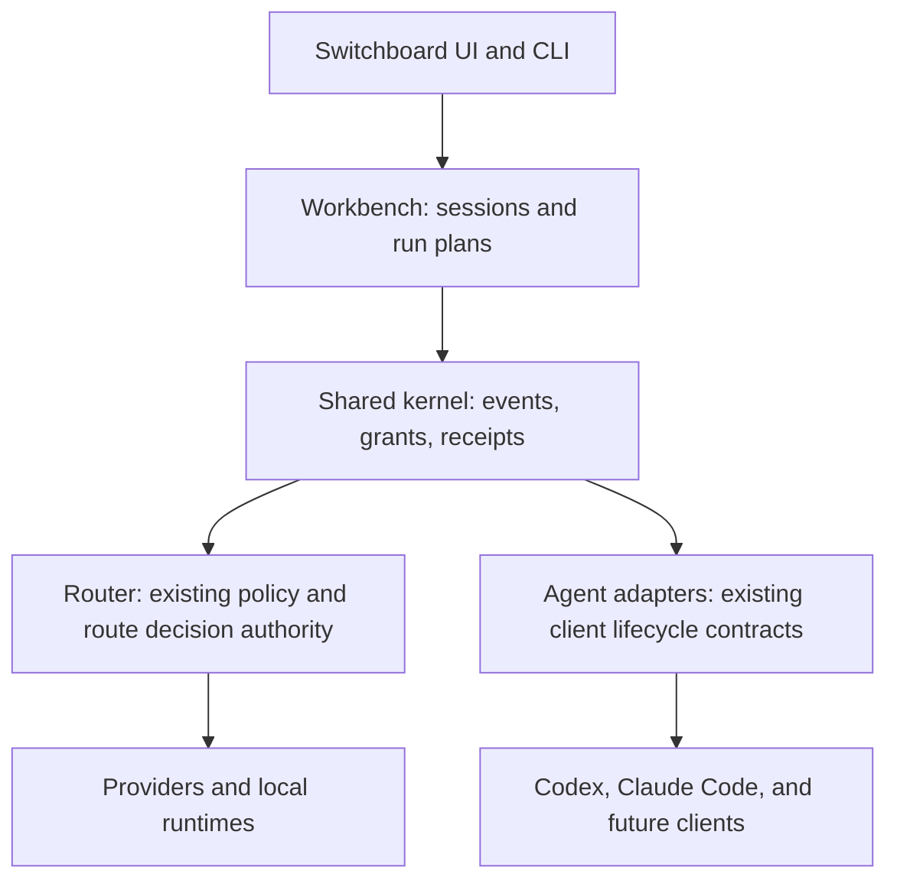

# Switchboard Router and Workbench implementation plan

Updated: 2026-08-23

## Product decision

AI Switchboard has two first-class product surfaces backed by one kernel:

- **Switchboard Router** is the local, headless routing and optimization layer.
  It remains usable from existing coding clients and other local applications
  without starting an agent loop.
- **Switchboard Workbench** is the all-in-one control surface for sessions,
  agent-run plans, capability grants, tools, replay, and eventually managed
  execution. It calls the Router as a capability; it never replaces or runs a
  second routing policy.



The Workbench starts **non-autonomous**. It may create and replay local plans,
but cannot launch a shell, call a provider, modify a workspace, or persist a
prompt/tool result until a later execution backend passes its own consent,
redaction, rollback, and release gates.

## Current inventory

| Capability | Current authority | Status | Workbench action |
|---|---|---|---|
| Model/provider route policy and evidence thresholds | `src-tauri/src/optimization/model_routing.rs` | Done | Reuse as the Router authority; add a Workbench session reference only. |
| Endpoint/route plan and transport observations | `src-tauri/src/route_plan.rs`, `transport_observations.rs` | Done | Reuse their content-free routing evidence; do not duplicate proxy logic. |
| Coding-client detect/plan/consent/apply/verify/rollback | `src-tauri/src/client_adapter_contract.rs` | Done | Wrap as a planning adapter; keep it the only configuration mutation authority. |
| OSS strategy fixtures and redacted route replay | `oss_harness_replay.rs`, `scripts/oss-harness-strategies.mjs` | Done | Promote their schema into the kernel event/replay boundary. |
| Session-event prototype | `scripts/oss-session-events.mjs` | Done, prototype | Port its contiguous lifecycle/fork rules to native persistent storage. |
| Context packs and agent memory | `src/lib/agentSessionPacks.ts`, `src-tauri/src/agent_memory/` | Done, bounded | Reference pack IDs/digests only; do not persist prompts or source content. |
| OSS capability metadata/promotion gate | `oss_capabilities.rs`, `plugin_promotion_gate.rs` | Done, metadata only | Project from Kernel registry/grants while retaining fail-closed promotion. |
| Selective activation receipts | `activation_commands.rs` | Done | Use the same ownership/rollback model for future capability changes. |
| Durable Workbench session/run authority | `src-tauri/src/workbench_kernel/` | Done, plan-only | Persist opaque sessions and prepare non-executable router/adapter plans. |
| Real agent execution backend | — | Remaining build, deliberately gated | Add only after the non-autonomous kernel and UI are verified. |

## OSS reuse and provenance policy

| Upstream | Licence/state | Reuse | Explicit non-reuse |
|---|---|---|---|
| [DeepSeek Harness](https://github.com/deepseek-ai/deepseek-harness) | MIT; developer preview with breaking-change risk | Plugin capability vocabulary, durable session/event distinction, scoped capability concepts | No vendored runtime, plugin binary, scheduler, credential flow, or automatic execution. |
| [NVIDIA NeMo Switchyard](https://github.com/NVIDIA-NeMo/Switchyard) | Apache-2.0; reviewed as optional/interoperability-only | Protocol-translation and typed strategy ideas; benchmark fixtures | No second live router, embedded server, automatic install, or configuration rewrite. |
| [JCode](https://github.com/Ravi-bit-app/jcode) | MIT advertised upstream | Attach/resume, multi-session lifecycle, adaptive context and resource profiling ideas | No source/binary/credential/provider-code vendoring without a separately pinned dependency inventory. |
| [twaldin/harness](https://github.com/twaldin/harness) | Evaluate and pin before any dependency use | `RunSpec -> RunResult` adapter boundary and per-CLI isolation | No subprocess execution or instruction-file mutation in the initial kernel. |

Every future OSS addition needs: pinned URL/commit, licence and attribution,
compatibility matrix, capability declaration, privacy/redaction review,
rollback/disable path, deterministic tests, and a visible UI disclosure. The
existing `plugin_promotion_gate.rs` remains the promotion authority.

## Kernel contracts

```text
workbench_kernel/
  session.rs       durable content-free identity, status, lineage, timestamps
  events.rs        bounded versioned lifecycle ledger and deterministic forks
  run_contract.rs  RunSpec, RunPlan, Router reference, and capability requests
  storage.rs       atomic local ledger persistence and bounded retention
```

Invariants:

- A session event contains only bounded identifiers, event kind, sequence,
  parent reference, local timestamps, route/adapter/capability IDs, and opaque
  digests. Prompts, model messages, outputs, headers, endpoint URLs,
  credentials, filesystem paths, and tool arguments are forbidden.
- Session events are contiguous, append-only, bounded, and transition through
  `active -> paused -> active|completed|cancelled`; forking is explicit and
  deterministic.
- A `RunSpec` is declarative and non-executable by default. It holds an
  existing workspace/reference digest, adapter ID, context-pack digest, route
  decision reference, capability grants, and receipt IDs—not content.
- `RunPlan` may expose configuration dry-run evidence from the existing
  `CodingClientAdapter` contract but cannot apply it. Existing adapter consent
  and rollback rules remain unchanged.
- Capability requests are default-deny, session scoped, visible in the UI, and
  non-executable. Expiry-bound grants and change receipts remain a later
  execution-gate deliverable.
- The Router has one decision owner: existing model routing. A Workbench plan
  may link to the decision but cannot alter a live provider request.

## Phased delivery

### Phase 0 — foundations already shipped — Done

- [x] Local Router policy, route plans, model-routing evidence and transport
  observations.
- [x] Client-adapter lifecycle contracts, config consent, verification and
  rollback.
- [x] Redacted replay, deterministic strategy fixtures, session-event
  prototype, static OSS metadata, and promotion gates.
- [x] Receipt-owned, drift-safe activation rollback for Headroom, RTK,
  Ponytail, Caveman, Leanctx, Chonkify, MarkItDown, and master native add-ons.
  MarkItDown rollback removes only run-created artifacts after their exact
  post-activation fingerprints match; broad Addons cleanup remains explicit.

### Phase 1 — consolidated architecture and provenance — Done

Deliverables:

- [x] This single Router/Workbench architecture and OSS-reuse plan.
- [x] Explicit reuse/non-reuse decision for DeepSeek Harness, Switchyard,
  JCode, and a unified CLI-harness contract reference.
- [x] Link this plan from the master implementation ledger.

Acceptance: the plan names one authority for routing, client mutation,
promotion, and rollback; no external runtime is silently copied or enabled.

### Phase 2 — native Workbench Kernel — Done

Deliverables:

- [x] `WorkbenchSession` ledger with atomic persistence, retention cap,
  migration/version rejection, content-free validation, and deterministic
  `forkAtEvent` lineage.
- [x] Typed `WorkbenchEvent`, `RunSpec`, `RunPlan`, `CapabilityRequest`, and
  `RouterDecisionReference` contracts.
- [x] Native commands to create, inspect, transition, fork, and export an
  observe-only session/run plan.
- [x] Projection of the existing static OSS registry and client-adapter dry
  run into the kernel without duplicate configuration logic.
- [x] Rust tests for forbidden keys, transition failures, persistence,
  idempotency, retention, and adapter/router boundary failures.

Acceptance met: a user can create, inspect, transition, fork, list, and
prepare an inspectable local plan without provider traffic, shell launch,
workspace mutation, or secret/content persistence. The visible UI follows in
Phase 3.

### Phase 3 — visible Workbench core UI — Done

Deliverables:

- [x] Workbench navigation surface beside Routing, with visible plan-only,
  provider-traffic, and write-state badges.
- [x] Content-free session creation, selection, timeline, explicit lifecycle,
  deterministic latest-event fork, and copy-only ledger export controls.
- [x] Observe-only Router decision references, adapter dry-run plans, bounded
  capability request controls, and truthful desktop/empty/error states.
- [x] Focused UI/bridge tests for navigation, loaded state, digest-only input,
  plan preparation, and the absence of an execution control.

Acceptance met: the non-autonomous Workbench kernel is visible and usable from
the desktop UI; unavailable execution is labelled as unavailable rather than
hidden.

### Phase 3.1 — verified Router and replay references — Done

Deliverables:

- [x] Native observe-only completion atomically persists its existing redacted
  evidence and one durable Router decision receipt. The receipt has an opaque
  ID, bounded metadata, and a SHA-256 digest over canonical content-free
  metrics; prompts, raw task text, responses, paths, provider payloads, and
  replay inputs remain excluded.
- [x] Bounded native list and resolver commands return only receipt-backed
  decisions. A manually recorded evidence event, replay digest, unknown ID,
  missing source event, altered receipt, or malformed policy fails closed.
- [x] The Router evidence screen visibly reports a completed receipt, and the
  Workbench replaces manual Router ID/digest fields with a native picker. Plan
  preparation resolves the selected ID again in Rust rather than trusting the
  renderer.
- [x] Replace the Addons-local OSS registry fetch with the typed shared
  Workbench projection. Native equality and UI tests preserve provider/tool
  labels and fail-closed plan-only/no-traffic/no-write state; registry rows
  remain display-only and cannot trigger Addons lifecycle actions.
- [x] Reuse the existing native redacted-replay validator as the sole parser,
  then issue a separate bounded content-free replay receipt. Its atomic local
  ledger contains only an opaque ID, validation time, counts, fixed
  observe-only flags, and verifiable source/receipt digests—never a path, raw
  event, task class, route/outcome data, prompt, response, or credential.
- [x] Add native replay receipt list/resolve commands and a Workbench picker
  that sends only `replayReferenceId`; native plan creation resolves it again,
  includes it in the plan digest, and rejects capability/receipt mismatches or
  caller-supplied replay metadata. Replay remains provider-free, plan-only,
  non-promoting, and non-executable.
- [x] Add native-owned Router and Workbench presets only as inspectable drafts:
  Router presets load existing observe-only policy into the form without saving;
  Workbench presets compose only existing Router/replay receipts and adapter
  plan capabilities. Preset evidence source, no-write/no-traffic state, and
  plan-only execution state are visible. Presets cannot issue handles, validate
  routes, promote routes, save policy, or execute a plan.
- [x] Harden Workbench plan contracts so every plan declares the existing
  `router_observe` and `client_adapter_plan` capabilities, while replay and
  repository-context capabilities are paired exactly with their native receipt
  or digest inputs. Native preset IDs must resolve and match their capability
  composition exactly.

Acceptance met: an observe-only Router completion now supplies a verifiable,
durable Workbench selection without creating a second Router, accepting manual
evidence claims, or exposing route content. A separately verified redacted
replay can now be selected with the same native re-resolution boundary; presets
are native-issued plan/policy drafts with no promotion path.

Gate: do not collapse existing Addons, Router, or replay authorities into a
new Workbench copy. Each remaining link must retain its current promotion and
rollback rules.

### Phase 4 — execution adapter readiness — In progress, gated

Deliverables:

- [x] Metadata-only Codex and Claude Code compatibility matrix: fixed known
  candidate-location presence is returned without a path; CLI version state is
  explicitly `not_probed` because a version probe would start a process.
- [x] A command-builder-only `RunSpec -> RunPlan` readiness projection using
  the existing dry-run client adapter contract. It has a logical binary and
  adapter-plan ID only—no executable path, argv, shell, environment, working
  directory, instruction, timeout, prompt, credential, provider traffic, or
  start capability. Canonical `codex` and `claude_code` only are accepted.
- [x] A native-owned, content-free `ProcessRunSpec` is attached only to those
  command-ready plans. It is deterministically bound to the session, adapter
  plan, adapter contract, and workspace digest; records `not_started` and
  `not_granted`; and requires a future native fixed timeout, app-owned Unix
  process group, null stdin, bounded redacted output, and TERM-then-KILL group
  cleanup. It has no command path, argv, shell, environment, cwd, prompt,
  credential, PID/PGID, user-controlled timeout, process registry, or start
  endpoint.
- [ ] Version probing or runnable-binary validation, only after an explicit
  process-start capability and containment/receipt model are available.
- [ ] Explicit capability approval, bounded timeout/cancel model, process
  containment, content-free metrics, and a receipt-backed cleanup plan.
- [ ] Deterministic fake-adapter tests, then a separate opt-in local manual
  test. No provider credentials are read by the planning path.

Gate: no arbitrary shell, terminal, browser, provider, or workspace write can
be promoted without per-capability approval, process ownership, cancel/resume,
event redaction, rollback, and local/manual evidence.

### Phase 5 — guarded execution and orchestration — Remaining build

Deliverables:

- [ ] Opt-in local execution backend for one approved adapter at a time.
- [ ] Goal queue, bounded subagent scheduler, workspace lock/conflict model,
  and human approval checkpoints.
- [ ] Attach/resume/cancel and replay/fork semantics with execution receipts.
- [ ] Budget and concurrency limits, deterministic completion/failure tests,
  and visible per-session resource/evidence status.

Gate: subagents may propose or run only granted capabilities. They cannot
escalate privileges, publish, apply external changes, or absorb private prompt
content into the session ledger.

### Phase 6 — optional upstream interoperability — Prepared, externally gated

- [ ] A specific pinned DeepSeek/Switchyard/JCode workflow with compatibility,
  licence attribution, privacy, rollback, operational ownership and release
  evidence.
- [ ] A dedicated optional profile that is disabled by default and removable
  through a receipt-owned rollback.

## Verification and publication

Each phase is committed and pushed separately. Required evidence is scoped to
the phase: deterministic Rust/TypeScript tests, type checking where the
existing checkout permits it, no sensitive fields in persisted artifacts,
read-only/no-network plan-mode proof, and a clean staged diff. Existing user
work remains unmodified and unstaged.
