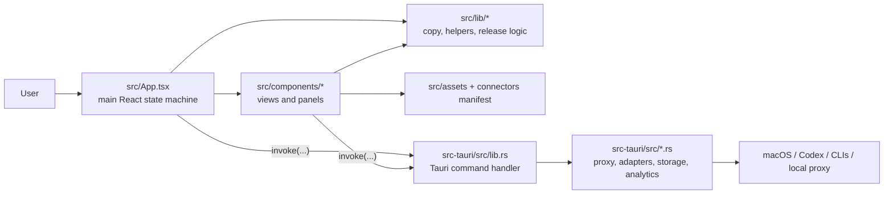

# Mac AI Switchboard Repo Map

Generated: 2026-07-05T10:51:00.742Z

## Artifacts

- `graphify-out/graph.json`: Graphify AST/knowledge graph output.
- `graphify-out/GRAPH_TREE.html`: Graphify interactive tree view.
- `docs/repo-map/madge-src.json`: TypeScript dependency map.
- `docs/repo-map/dependency-cruiser-src.json`: dependency-cruiser module map.
- `docs/repo-map/cargo-metadata.json`: Rust crate dependency metadata.
- `docs/repo-map/architecture.mmd`: high-level Mermaid architecture.
- `docs/repo-map/repo-map.json`: synthesized machine-readable map.

## Tool Results

- Graphify: partial-success; 4015 nodes, 11057 links.
- Madge: 133 frontend modules, 264 import edges, no cycles found.
- dependency-cruiser: 46 modules, 45 edges.
- Cargo metadata: 39 direct Rust dependencies.

## Shape

- Frontend source files: 131
- Rust source files: 75
- Docs: 35
- Scripts: 59

## Main Runtime Flow

## Frontend Hotspots

- `App.tsx`: imports 44
- `components/HomeView.tsx`: imports 13
- `components/AddonsView.tsx`: imports 8
- `components/SettingsView.tsx`: imports 7
- `components/OptimizationView.tsx`: imports 6
- `components/SwitchboardPanel.tsx`: imports 5
- `lib/doctorRepairCopy.ts`: imports 5
- `components/DailySavingsChart.tsx`: imports 4
- `components/OptimizationDashboard.tsx`: imports 4
- `components/SavingsCalculatorCard.tsx`: imports 4
- `components/SettingsConnectorPanel.tsx`: imports 4
- `lib/settingsConnectorCopy.test.ts`: imports 4
- `lib/settingsConnectorCopy.ts`: imports 4
- `main.tsx`: imports 4
- `components/ActivityFeed.tsx`: imports 3
- `components/PlannedAddonCard.tsx`: imports 3
- `components/SwitchboardDoctorPanel.tsx`: imports 3
- `components/UpgradeView.tsx`: imports 3
- `lib/appSupport.ts`: imports 3
- `lib/appUpdate.ts`: imports 3

## Strongest Folder-Level Edges

- `src/App.tsx -> ./lib`: 27
- `src/App.tsx -> ./components`: 16
- `src/App.tsx -> src/assets`: 1
- `src/App.tsx -> ✖`: 1

## Tauri Command Wiring

- Frontend invokes: 82
- Rust commands declared: 122
- Commands in invoke handler: 122
- Invoked commands missing a Rust command: none
- Invoked commands missing from invoke handler: none
- Handler commands not called by current frontend scan: 40

## Direct Dependencies

- NPM runtime: @microsoft/clarity, @phosphor-icons/react, @sentry/react, @tauri-apps/api, react, react-dom, recharts
- NPM dev: @tauri-apps/cli, @testing-library/jest-dom, @testing-library/react, @testing-library/user-event, @types/react, @types/react-dom, @vitejs/plugin-react, @vitest/coverage-v8, jsdom, postcss, typescript, vite, vitest
- Rust runtime/build/dev direct deps: 39

## Useful Commands

- `npm test -- --run`
- `npm run lint`
- `npm run test:rust`
- `npx --yes madge src --extensions ts,tsx --ts-config tsconfig.json --circular`
- `npx --yes dependency-cruiser src --no-config --output-type json`
- `uvx --from graphifyy graphify . --no-cluster`

